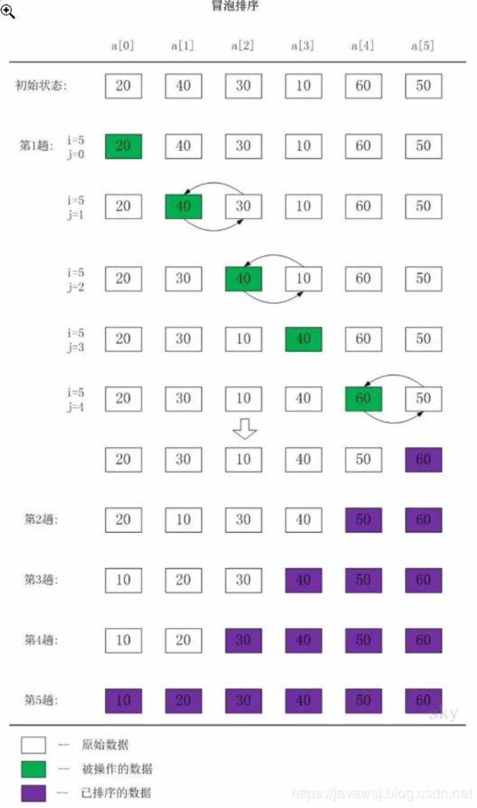
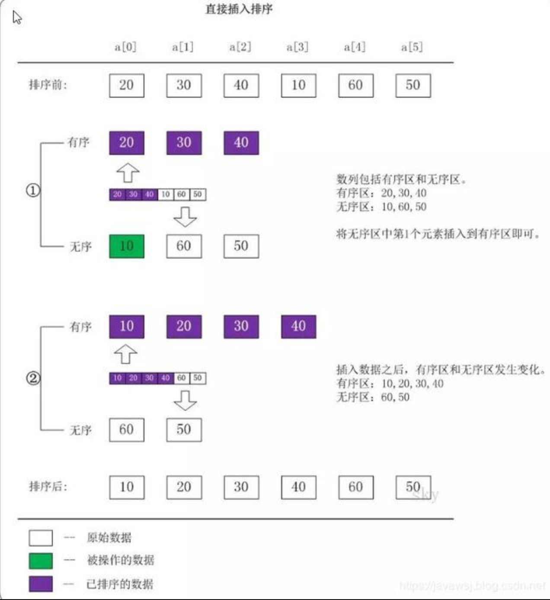
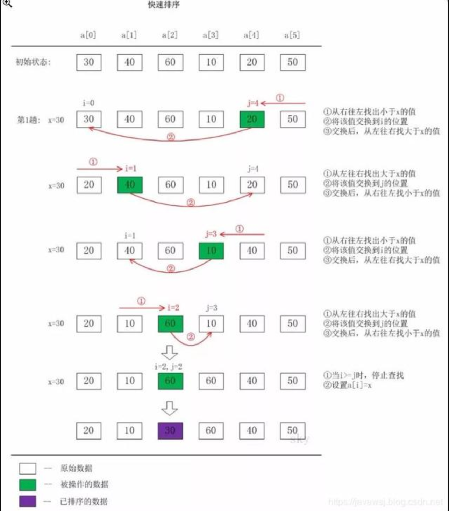
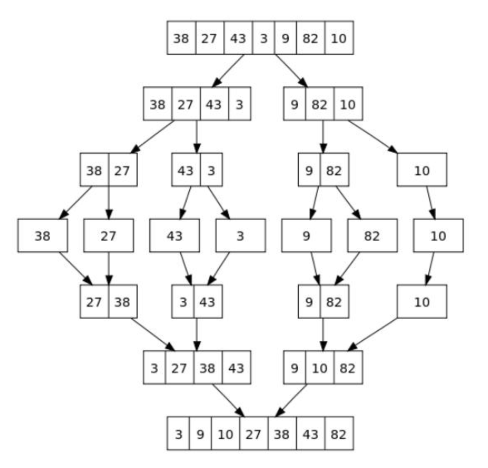

- [课后作业](#课后作业)
	- [一个数如果恰好等于它的因子之和，这个数称为"完数"，例如6=1+2+3，编程找出1000以内的完数](#一个数如果恰好等于它的因子之和这个数称为完数例如6123编程找出1000以内的完数)
	- [输入一个字符串，判断是否是回文，回文字符串是指从左到右读和从右到左读完全相同的字符串](#输入一个字符串判断是否是回文回文字符串是指从左到右读和从右到左读完全相同的字符串)
	- [输入一行字符，分别统计出其中英文字母，空格，数字和其他字符的个数](#输入一行字符分别统计出其中英文字母空格数字和其他字符的个数)
	- [计算俩个大数相加的和，这俩个大数会超过int64的表示范围](#计算俩个大数相加的和这俩个大数会超过int64的表示范围)
- [实现一个冒泡排序](#实现一个冒泡排序)
- [实现一个选择排序](#实现一个选择排序)
- [实现一个插入排序](#实现一个插入排序)
- [实现一个快速排序](#实现一个快速排序)
- [分金币](#分金币)

# 课后作业

## 一个数如果恰好等于它的因子之和，这个数称为"完数"，例如6=1+2+3，编程找出1000以内的完数

## 输入一个字符串，判断是否是回文，回文字符串是指从左到右读和从右到左读完全相同的字符串

## 输入一行字符，分别统计出其中英文字母，空格，数字和其他字符的个数

## 计算俩个大数相加的和，这俩个大数会超过int64的表示范围

```go
package main

import (
	"bufio"
	"fmt"
	"os"
	"strings"
)
//2. 一个数如果恰好等于它的因子之和，这个数称为"完数"，例如6=1+2+3，编程找出1000以内的完数
func ws2() {
	for i := 1; i <= 100000; i++ {
		var sum int
		for j := 1; j <= (i / 2); j++ {
			if i%j == 0 {
				sum += j
			}
		}
		if sum == i {
			fmt.Println(sum)
		}

	}
}

//3. 输入一个字符串，判断是否是回文，回文字符串是指从左到右读和从右到左读完全相同的字符串
// > 新知识点：[]rune(str_a)
func strs() {
	var str_a string
	for {
		fmt.Scanf("%s", &str_a)
		t := []rune(str_a) //rune表示一个字符,比如一个汉字字符占用3个字节
		length := len(t)
		for i, _ := range t {
			if i == length/2 {
				break
			}
			last := length - i - 1
			if t[i] != t[last] {
				fmt.Println("no")
			}
		}
		fmt.Println("yes")
		
		//第二种方式，不适用与中文
		// var str_rev string
		// for i := len(str_a) - 1; i >= 0; i-- {
		// 	str_rev += fmt.Sprintf("%c", str_a[i])
		// }
		// if str_a == str_rev {
		// 	fmt.Printf("string true---%s\n", str_rev)
		// } else {
		// 	fmt.Printf("string false---%s\n", str_rev)
		// 	break
		// }
	}
}

//4. 输入一行字符，分别统计出其中英文字母，空格，数字和其他字符的个数
// >新函数,[]rune(),bufio.NewReader(os.Stdin),reader.ReadLine()
func count4(str string) (worldCount, spaceCount, numberCount, otherCount int) {
	t := []rune(str) //表示一个字符
	for _, v := range t {
		switch {
		case v >= 'a' && v <= 'z':
			fallthrough
		case v >= 'A' && v <= 'Z':
			worldCount++
		case v == ' ':
			spaceCount++
		case v >= '0' && v <= '9':
			numberCount++
		default:
			otherCount++
		}
	}
	return
}
func read_line() {
	reader := bufio.NewReader(os.Stdin) //终端输入
	result, _, err := reader.ReadLine() //读取行
	if err != nil {
		fmt.Println("read form console err:", err)
		return
	}
	wc, sc, nc, oc := count4(string(result))
	fmt.Printf("worldcount:%d\nspacecount:%d\nnumvercount:%d\nothercount:%d\n", wc, sc, nc, oc)

}

//5. 计算俩个大数相加的和，这俩个大数会超过int64的表示范围
func multi(str1, str2 string) (result string) {
	if len(str1) == 0 && len(str2) == 0 {
		result = "0"
		return
	}
	var index1 = len(str1) - 1
	var index2 = len(str2) - 1
	var left int
	for index1 >= 0 && index2 >= 0 {
		c1 := str1[index1] - '0'
		c2 := str2[index2] - '0'
		sum := int(c1) + int(c2) + left
		if sum >= 10 {
			left = 1
		} else {
			left = 0
		}
		c3 := (sum % 10) + '0'
		result = fmt.Sprintf("%c%s", c3, result)
		index1--
		index2--
	}
	for index1 >= 0 {
		c1 := str1[index1] - '0'
		sum := int(c1) + left
		if sum >= 10 {
			left = 1
		} else {
			left = 0
		}
		c3 := (sum % 10) + '0'
		result = fmt.Sprintf("%c%s", c3, result)
		index1--
	}
	for index2 >= 0 {
		c1 := str2[index2] - '0'
		sum := int(c1) + left
		if sum >= 10 {
			left = 1
		} else {
			left = 0
		}
		c3 := (sum % 10) + '0'
		result = fmt.Sprintf("%c%s", c3, result)
		index2--
	}
	if left == 1 {
		result = fmt.Sprintf("1%s", result)
	}
	return
}

func sum_main() {
	reader := bufio.NewReader(os.Stdin)
	result, _, err := reader.ReadLine()
	if err != nil {
		fmt.Println("read from console err:", err)
	}
	strSlice := strings.Split(string(result), "+")
	if len(strSlice) != 2 {
		fmt.Println("please input a+b")
	}

	strnumber1 := strings.TrimSpace(strSlice[0])
	strnumber2 := strings.TrimSpace(strSlice[1])
	fmt.Println(multi(strnumber1, strnumber2))

}

func main() {
	// jj9()
	// ws2()
	// strs()
	// read_line()
	sum_main()
}
```

# 实现一个冒泡排序

冒泡排序(Bubble Sort)，又被称为气泡排序或泡沫排序。

它是一种较简单的排序算法。它会遍历若干次要排序的数列，每次遍历时，它都会从前往后依次的比较相邻两个数的大小；如果前者比后者大，则交换它们的位置。这样，一次遍历之后，最大的元素就在数列的末尾！采用相同的方法再次遍历时，第二大的元素就被排列在最大元素之前。重复此操作，直到整个数列都有序为止！



# 实现一个插入排序

直接插入排序(Straight Insertion Sort)的基本思想是：把n个待排序的元素看成为一个有序表和一个无序表。开始时有序表中只包含1个元素，无序表中包含有n-1个元素，排序过程中每次从无序表中取出第一个元素，将它插入到有序表中的适当位置，使之成为新的有序表，重复n-1次可完成排序过程。

直接插入排序图文说明




# 实现一个快速排序

快速排序(Quick Sort)使用分治法策略。

它的基本思想是：选择一个基准数，通过一趟排序将要排序的数据分割成独立的两部分；其中一部分的所有数据都比另外一部分的所有数据都要小。然后，再按此方法对这两部分数据分别进行快速排序，整个排序过程可以递归进行，以此达到整个数据变成有序序列。

**快速排序流程：**

从数列中挑出一个基准值。

将所有比基准值小的摆放在基准前面，所有比基准值大的摆在基准的后面(相同的数可以到任一边)；在这个分区退出之后，该基准就处于数列的中间位置。

递归地把"基准值前面的子数列"和"基准值后面的子数列"进行排序。




# 归并排序

>将待排序的数列分成若干个长度为1的子数列，然后将这些数列两两合并；得到若干个长度为2的有序数列，再将这些数列两两合并；得到若干个长度为4的有序数列，再将它们两两合并；直接合并成一个数列为止。



```go
package main

import "fmt"

func main() {
	arr := []int{38, 27, 43, 3, 9, 82, 10}
	result := mergeSort(arr)
	fmt.Println(result)
}

/**
归并排序（Merge sort，台湾译作：合并排序）是建立在归并操作上的一种有效的排序算法。该算法是采用分治法（Divide and Conquer）的一个非常典型的应用
分治思想，时间复杂度为：O(n*log(n))
*/

func mergeSort(arr []int) []int {
	if len(arr) < 2 {
		return arr
	}
	i := len(arr) / 2
	left := mergeSort(arr[0:i])
	right := mergeSort(arr[i:])
	result := merge(left, right)
	return result
}

func merge(left, right []int) []int {
	result := make([]int, 0)
	m, n := 0, 0 // left和right的index位置
	l, r := len(left), len(right)
	for m < l && n < r {
		if left[m] > right[n] {
			result = append(result, right[n])
			n++
			continue
		}
		result = append(result, left[m])
		m++
	}
	result = append(result, right[n:]...) // 这里竟然没有报数组越界的异常？
	result = append(result, left[m:]...)
	return result
}
```


# 分金币

```go
package main

import "fmt"

/*
你有50枚金币，需要分配给以下几个人：Matthew,Sarah,Augustus,Heidi,Emilie,Peter,Giana,Adriano,Aaron,Elizabeth。
分配规则如下：
a. 名字中每包含1个'e'或'E'分1枚金币
b. 名字中每包含1个'i'或'I'分2枚金币
c. 名字中每包含1个'o'或'O'分3枚金币
d: 名字中每包含1个'u'或'U'分4枚金币
写一个程序，计算每个用户分到多少金币，以及最后剩余多少金币？
程序结构如下，请实现 ‘dispatchCoin’ 函数
*/
var (
	a1 = [...]string{"Matthew", "Sarah", "Augustus", "Heidi", "Emilie", "Peter", "Giana", "Adriano", "Aaron", "Elizabeth"}
	ma = make(map[string]int, len(a1))
	sy = 50
)

func dispatchCoin() {
	for _, v := range a1 {
		for _, i := range []rune(v) {
			switch i {
			case 'e', 'E':
				ma[v]++
				sy--
			case 'i', 'I':
				ma[v] += 2
				sy -= 2
			case 'o', 'O':
				ma[v] += 3
				sy -= 3
			case 'u', 'U':
				ma[v] += 4
				sy -= 4
			}
		}
		fmt.Printf("name: %s\tjb: %d \n", v, ma[v])
	}
	fmt.Printf("最后剩余: %d\n", sy)
}

func f(n int) int {
	if n == 1 {
		return 1
	}
	return n * f(n-1)
}

func main() {
	// dispatchCoin()
	fmt.Println(f(20))
}
```


