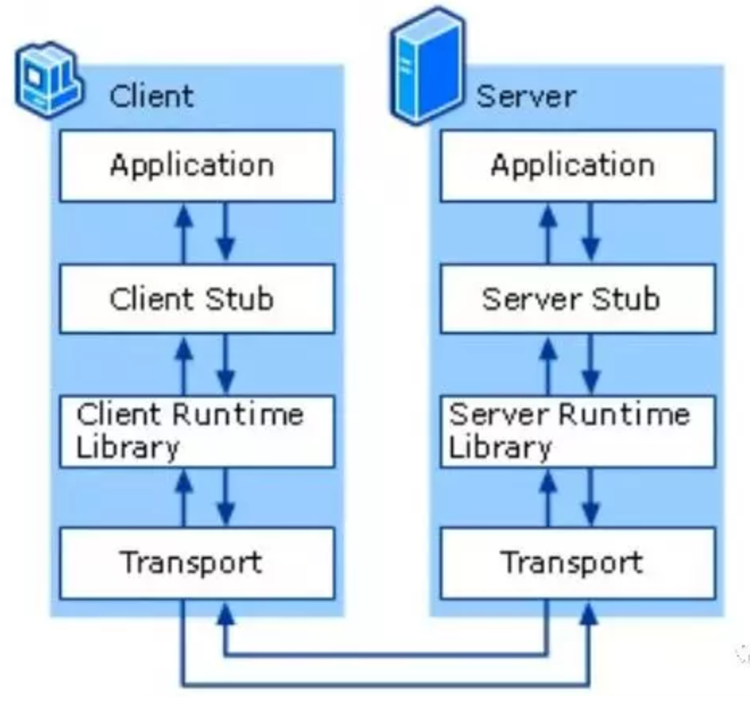

[TOC]

> 摘要: 总体上来说，HTTP每次请求比较浪费资源的。虽然HTTP也是走在TCP上面的，但是HTTP请求自己添加了很多自己的信息，因此会消耗带宽资源。所以一些公司就是用RPC作为内部应用的通信协议。

# rpc

RPC(Remote Procedure Call，远程过程调用) 是一种通过网络从远程计算机程序上请求服务，而不需要了解底层网络细节的应用程序通信协议。rpc协议构建于tpc或udp，或者是http上。

在go中，标准库提供的net/rpc包实现了rpc协议需要的相关细节，开发者可以很方便的开发rpc的服务端和客户端程序。



RPC本身就是一个client-server模型。


## server端

```GO
package main

import (
    "fmt"
    "log"
    "net"
    "net/http"
    "net/rpc"
    "os"
    "time"
)

type Args struct {
    A, B int
}

type Math int

//计算乘积
func (t *Math) Multiply(args *Args, reply *int) error {
    time.Sleep(time.Second * 3) //睡1秒，同步调用会等待，异步会先往下执行
    *reply = args.A * args.B
    fmt.Println("Multiply")
    return nil
}

//计算和
func (t *Math) Sum(args *Args, reply *int) error {
    time.Sleep(time.Second * 3)
    *reply = args.A + args.B
    fmt.Println("Sum")
    return nil
}

func main() {
    //创建对象
    math := new(Math)
    //rpc服务注册了一个Math对象 公开方法供客户端调用
    rpc.Register(math)
    //指定rpc的传输协议 这里采用http协议作为rpc调用的载体 也可以用rpc.ServeConn处理单个连接请求
    rpc.HandleHTTP()
    l, e := net.Listen("tcp", ":1234")
    if e != nil {
        log.Fatal("listen error", e)
    }
    go http.Serve(l, nil)
    os.Stdin.Read(make([]byte, 1))
}
```


## client端

```go
package main

import (
    "fmt"
    "log"
    "net/rpc"
    "time"
)

type Args struct {
    A, B int
}

func main() {
    //调用rpc服务端提供的方法之前，先与rpc服务端建立连接
    client, err := rpc.DialHTTP("tcp", "127.0.0.1:1234")
    if err != nil {
        log.Fatal("dialHttp error", err)
        return
    }
    //同步调用服务端提供的方法

    args := &Args{7, 8}
    var reply int
    //可以查看源码 其实Call同步调用是用异步调用实现的。后续再详细学习
    err = client.Call("Math.Multiply", args, &reply) //这里会阻塞三秒

    if err != nil {
        log.Fatal("call Math.Multiply error", err)
    }
    fmt.Printf("Multiply:%d*%d=%d\n", args.A, args.B, reply)

    //异步调用

    var sum int

    divCall := client.Go("Math.Sum", args, &sum, nil)

    //使用select模型监听通道有数据时执行，否则执行后续程序
    for {
        select {
        case <-divCall.Done:
            fmt.Printf("%d+%d是%d, 退出执行!", args.A, args.B, sum)
            return
        default:
            fmt.Println("继续等待....")
            time.Sleep(time.Second * 1)
        }
    }
}
```

## 过程调用解析

server端

- rpc服务注册了一个Math对象 公开方法供客户端调用
- 采用http协议作为rpc调用的载体, 处理请求

client端

- 调用rpc服务端提供的方法之前，先与rpc服务端建立连接
- 使用Call 方法调用远程方法