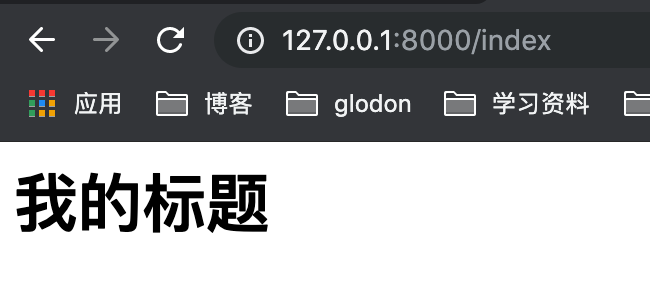

[toc]

# gin渲染

## 各种数据格式的响应

> json、结构体、xml、yaml类似于java的properties、ProtoBuf

```go
package main

import (
	"github.com/gin-gonic/gin"
	"github.com/gin-gonic/gin/testdata/protoexample"
)

// gin渲染
func main() {
	r:=gin.Default()
	// 1. json 响应
	r.GET("/someJson",func(c *gin.Context){
		c.JSON(200,gin.H{"message":"someJson","status":200})
	})
	// 2. 结构体返回
	r.GET("/someStruct",func(c *gin.Context){
		var msg struct {
			Name string
			Message string
			Number int
		}
		msg.Name="root"
		msg.Message="message"
		msg.Number=20
		c.JSON(200,msg)
	})
	// 3. xml
	r.GET("/someXML",func(c *gin.Context){
		c.XML(200,gin.H{"message":"abc"})
	})
	// 4. yaml 响应
	r.GET("/someYAML",func(c *gin.Context){
		c.YAML(200,gin.H{"name":"zhangsan"})
	})
	// 5. ProtoBuf 格式，google开发的高效存储读取的工具
	// 数组? 切片? 如果自己构建一个传输格式，应该是什么格式？
	r.GET("/someProtoBuf",func(c *gin.Context){
		reps:=[]int64{int64(1),int64(2)}
		// 定义数据
		label:="label"
		//传protobuf格式数据
		data:= & protoexample.Test{
			Label:            &label,
			Type:             nil,
			Reps:             reps,
			Optionalgroup:    nil,
			XXX_unrecognized: nil,
		}
		c.ProtoBuf(200,data)
	})
	r.Run(":8000")
}
```

## HTML模板渲染

- gin支持加载html模板，然后根据模板参数进行配置并返回相应的数据，**本质上就是字符串替换**

- LoadHTMLGlob() 方法可以加载模板文件

```go
// gin渲染
func main() {
	r:=gin.Default()
	// 1. 加载模板文件
	r.LoadHTMLGlob("../temp/*")
	//r.LoadHTMLFiles("html/index.html")  //指定文件
	r.GET("/index",func(c *gin.Context){
		// 2. 根据文件名渲染
		// 最终json将title替换
		c.HTML(200,"index.tmpl",gin.H{"title":"我的标题"})
	})
	r.Run(":8000")
}
---
<html>
    <h1>
        {{.title}}
    </h1>
</html>
```



## 重定向

```go
func main() {
	r:=gin.Default()
	r.GET("/redirect",func(c *gin.Context){
		// 支持内部和外部重定向
		c.Redirect(http.StatusMovedPermanently,"http://www.baidu.com")
	})
	r.Run(":8000")
}
```

## 同步和异步

- goroutine机制可以方便地实现异步处理
- 在启动新的goroutine时，**不应该使用原始上下文，必须使用它的只读副本**

```GO
func main() {
	r:=gin.Default()
	// 1. 异步
	r.GET("long_async",func(c *gin.Context){
		// 需要使用副本
		copyContext := c.Copy()
		// 异步处理
		go func(){
			time.Sleep(3* time.Second)
			log.Println("异步执行："+copyContext.Request.URL.Path)
		}()
	})

	// 2. 同步
	r.GET("/long_sync",func(c *gin.Context){
		time.Sleep(3 * time.Second)
		log.Println("同步执行："+c.Request.URL.Path)
	})
	r.Run(":8000")
}
```

