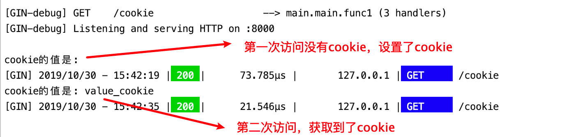
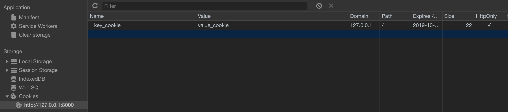
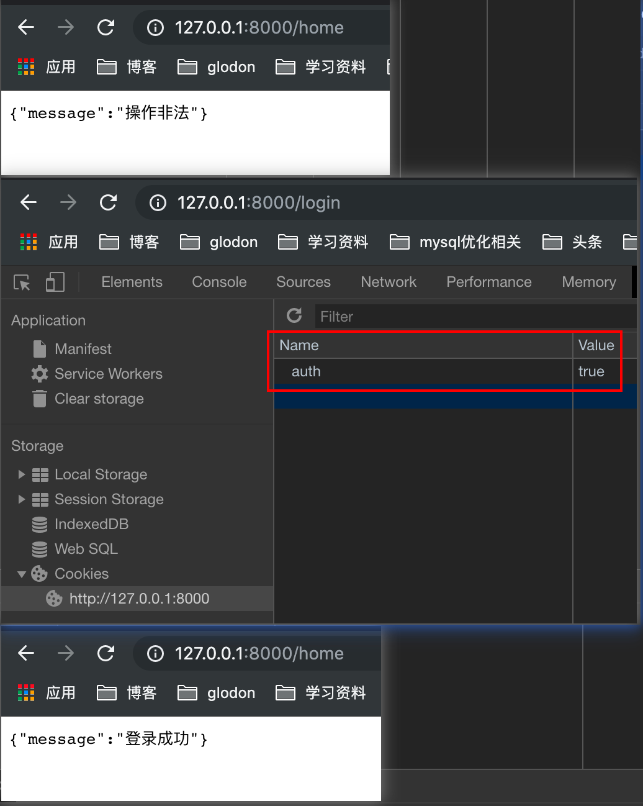

[toc]

# cookie是什么？

- http是无状态协议，服务器不能记录浏览器的访问状态，也就是说服务器不能区分两次请求是否由同一个客户端发出
- cookie就是解决http协议无状态的方案之一
- Cookie实际上就是服务器保存在浏览器上的一段信息。浏览器有了Cookie之后，每次向服务器发送请求时都会同时将该信息发送给服务器，服务器收到请求后，就可以根据该信息处理请求
- cookie由服务器创建，并发送给浏览器，最终由浏览器保存

## cookie的用途

- 保存用户登录状态
- 京东购物车，保存购物车信息

## cookie的使用

- 测试服务端发送cookie给客户端，客户端请求时携带cookie

```GO
package main
import (
	"fmt"
	"github.com/gin-gonic/gin"
)

func main() {
	r:=gin.Default()
	// 服务端要给客户端cookie
	r.GET("cookie",func(c *gin.Context){
		// 获取客户端是否携带cookie
		cookie,err := c.Cookie("key_cookie")
		if err !=nil{
			// 设置cookie
			c.SetCookie(
				"key_cookie", // 设置cookie的key
				"value_cookie", // 设置cookie的值
				60, // 过期时间
				"/", // 所在目录
				"127.0.0.1",  //域名
				false,  // 是否只能通过https访问
				true) // 是否允许别人通过js获取自己的cookie
		}
		fmt.Println("cookie的值是:",cookie)
	})
	r.Run(":8000")
}
```





## cookie的练习

> 使用cookie，模拟实现权限验证中间件

```go
package main

import (
	"github.com/gin-gonic/gin"
	"net/http"
)
//1. 有俩个路由，login和home
//2. login用于设置cookie
//3. home是访问查看信息的请求
//4. 在请求home之前，先跑中间件代码，检验是否存在cookie
//5. 如果没有login设置cookie，就直接访问home，会显示无权限，因为权限校验没有通过

// 权限校验中间件
func authMiddleWare() gin.HandlerFunc{
	return func(c *gin.Context){
		// 获取客户端cookie并校验
		if cookie,err := c.Cookie("auth");err ==nil{
			if cookie == "true"{ //校验是否有key为auth,value为true的cookie
				c.Next()
				return
			}
		}
		// 否则就返回无权限
		c.JSON(http.StatusUnauthorized,gin.H{"message":"操作非法"})
		// 如果验证不通过,不在调用后续的函数处理,直接从中间件就返回请求
		c.Abort()
		return
	}
}

func main() {
	r:=gin.Default()
	// 服务端要给客户端cookie
	r.GET("/login",func(c *gin.Context){
		// 设置cookie
		c.SetCookie(
			"auth", // 设置cookie的key
			"true", // 设置cookie的值
			60, // 过期时间
			"/", // 所在目录
			"127.0.0.1",  //域名
			false,  // 是否只能通过https访问
			true) // 是否允许别人通过js获取自己的cookie
	})

	r.GET("/home",authMiddleWare(),func(c *gin.Context){
		c.JSON(200,gin.H{"message":"登录成功"})
	})
	r.Run(":8000")
}
```




## cookie的缺点

-  不安全，明文

- 增加带宽消耗

- 可以被禁用

- cookie有上限

# session是什么？

- session可以弥补cookie的不足，session必须依赖于cookie才能使用，生成一个sessionId放到cookie里面传递给客户端

## session和cookie的区别

1. Cookie 在客户端（浏览器），Session 在服务器端。
2. Cookie的安全性一般，他人可通过分析存放在本地的Cookie并进行Cookie欺骗。在安全性第一的前提下，选择Session更优。重要交互信息比如权限等就要放在Session中，一般的信息记录放Cookie就好了。
3. 单个Cookie保存的数据不能超过4K，很多浏览器都限制一个站点最多保存20个Cookie。 
4. Session 可以放在 文件、数据库或内存中，比如在使用Node时将Session保存在redis中。由于一定时间内它是保存在服务器上的，当访问增多时，会较大地占用服务器的性能。考虑到减轻服务器性能方面，应当适时使用Cookie。
5. Session 的运行依赖Session ID，而 Session ID 是存在 Cookie 中的，也就是说，如果浏览器禁用了 Cookie，Session 也会失效（但是可以通过其它方式实现，比如在 url 中传递 Session ID）。
6. 用户验证这种场合一般会用 Session。因此，维持一个会话的核心就是客户端的唯一标识，即Session ID。

## session中间件开发

>  设计一个通用的session服务，支持内存存储和redis存储
>
>  session模块设计：
>
>  	1. 本质上k-v系统，同key进行增删改查
>   	2. session可以存储在内存和redis

## session服务的关系图


