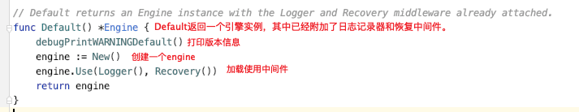
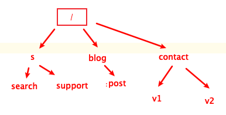

[toc]

# gin入门

## 介绍

- gin是一个golang的微框架，封装比较优雅，api友好，源码注释比较明确，具有快速灵活，容错方便等特点
- 对于golang而言，web框架的依赖要比python、java之类的要小的多，完全使用自身net/http包封装的，足够坚定，性能也非常好
- 介质框架开发，不仅可以省去很多常用的封装带来的时间，也有助于团队的编码风格和形成规范

## 安装

`go get -u -w github.com/gin-gonic/gin`

## 实例

```go
package main

import (
	"github.com/gin-gonic/gin"
	"net/http"
)

func main() {
	// 1. 创建路由
	r:=gin.Default()
	// 2. 绑定路由规则，执行的函数
	// gin.Context, 封装了request和response
	r.GET("/",func(c *gin.Context){
		c.String(http.StatusOK,"hello world")
	})
	// 3. 监听端口，默认是8080
	r.Run(":8000")
}
```

# gin路由

## 基本路由

- gin 框架中采用的路由库是基于httprouter做的

- 地址为：https://github.com/julienschmidt/httprouter

```go
package main

import (
	"github.com/gin-gonic/gin"
	"net/http"
)

func main() {
	// 1. 创建路由
	// 默认使用了2个中间件Logger(),recovery()
	r:=gin.Default()
	// 也可以创建不带中间件的路由
	// r := gin.New()

	// 2. 绑定路由规则，执行的函数
	// gin.Context, 封装了request和response
	r.GET("/",func(c *gin.Context){
		c.String(http.StatusOK,"hello world")
	})
	r.POST("/post",getting)
	r.PUT("/put")
	
	// 3. 监听端口，默认是8080
	r.Run(":8000")
}
```

**gin.default源码**



## RestFul风格的API

- gin支持restful风格的api
- 即Representational State Transfer的缩写。直接翻译的意思是"表现层状态转化"，是一种互联网应用程序的API设计理念：URL定位资源，用HTTP描述操作

| 操作     | 普通api         | restful风格api  |
| -------- | --------------- | --------------- |
| 获取文章 | /blog/getxxx    | GET blog/xxx    |
| 添加     | /blog/addxxx    | POST blog/xxx   |
| 修改     | /blog/updatexxx | PUT blog/xxx    |
| 删除     | /blog/delxxx    | DELETE blog/xxx |

## api传参

- 可以通过Context的Param方法来获取API参数

- localhost:8000/xxx/zhangsan

```go
package main

import (
	"github.com/gin-gonic/gin"
	"net/http"
)
// api传参
func main() {
	r:=gin.Default()
	// api传参
  // :name 占位符，可以获取url这个位置的参数
  // *action 占位符， 可以获取url这个位置以及以后的全部参数
	r.GET("/user/:name/*action",func(c *gin.Context){
		name:= c.Param("name")
		action := c.Param("action")
		c.String(http.StatusOK,name+"    "+action)
	})
	// 3. 监听端口，默认是8080
	r.Run(":8000")
}
// http://127.0.0.1:8000/user/lqx/study
// lqx    /study
```

## url传参

- URL参数可以通过DefaultQuery()或Query()方法获取

- DefaultQuery()若参数不存在，返回默认值，Query()若不存在，返回空串

- API ? name=zs

```go
package main

import (
	"fmt"
	"github.com/gin-gonic/gin"
	"net/http"
)
// uri传参
func main() {
	r:=gin.Default()
	r.GET("/wecome",func(c *gin.Context){
		// defaultQuery第二个参数是默认值
		name := c.DefaultQuery("name","jack")
		c.String(http.StatusOK,fmt.Sprintf("hello %s",name))
	})
	// 3. 监听端口，默认是8080
	r.Run(":8000")
}
// http://127.0.0.1:8000/wecome?name=lqx
// hello lqx
```

## 表单参数

- 表单参数为post请求，http常见的传输格式为四种
  - Application/json
  - Application/x-www-form-urlencoded
  - Application/xml
  - Multipart/form-data 
- 表单参数可以通过PostForm()方式获取，该方式默认解析的是x-www-form-urlencoded或者form-data格式的参数

```go
package main

import (
	"fmt"
	"github.com/gin-gonic/gin"
	"net/http"
)
// 表单参数
func main() {
	r:=gin.Default()
	r.POST("/formdata",func(c *gin.Context){
		// 表单参数设置默认值
		type1 :=c.DefaultPostForm("type","alert")
		username := c.PostForm("username")
		password := c.PostForm("password")
		hobbys := c.PostForm("hobby")

		c.String(http.StatusOK,fmt.Sprintf("type %s，formdata data is username:%s password:%s hobbys:%v",
			type1,
			username,
			password,
			hobbys))
	})
	// 3. 监听端口，默认是8080
	r.Run(":8000")
}

<form action="http://127.0.0.1:8000/formdata" method="post" enctype="application/x-www-form-urlencoded">
    用户名：<input type="text" name="username" >
    密&nbsp&nbsp码: <input type="password" name="password">
    <input type="checkbox" value="run" name="hobby">跑步
    <input type="checkbox" value="game" name="hobby">游戏
    <input type="checkbox" value="money" name="hobby">金钱
    <input type="submit" value="提交">
</form>
// http://127.0.0.1:8000/index.html
// type alert，formdata data is username:lqx password:123 hobbys:run
```

## 上传单个文件

- multipart/form-data格式用于文件上传

- gin文件上传与原生的net/http方法类似，不同在于gin把原生的request封装到c.Request中

```GO
// 上传单个文件
func main() {
	r:=gin.Default()
	r.POST("/upload",func(c *gin.Context){
		// 表单提交文件
		file,_:=c.FormFile("file")
		log.Println(file.Filename)
		// 默认传到项目根目录，名字用本身的名字
		c.SaveUploadedFile(file,file.Filename)
		//打印信息
		c.String(http.StatusOK,fmt.Sprintf("%s,upload!",file.Filename))
	})
	// 3. 监听端口，默认是8080
	r.Run(":8000")
}

<form action="http://127.0.0.1:8000/upload" method="post" enctype="multipart/form-data">
    头像：<input type="file" name="file" >
    <input type="submit" value="提交">
</form>
```

## 上传多个文件

```go
// 上传多个文件
func main() {
	r:=gin.Default()
	// 限制表单上传文件的大小为8MB,默认是32MB
	r.MaxMultipartMemory=8<<20
	r.POST("/uploads",func(c *gin.Context){
		// 表单提交文件
		form,err:=c.MultipartForm()
		if err!=nil{
			c.String(http.StatusBadRequest,fmt.Sprintf("get err %s",err.Error()))
		}
		// 获取全部图片
		files :=form.File["files"]
		for _,file := range files{
			//一个一个存
			if err := c.SaveUploadedFile(file,file.Filename);err !=nil{
				c.String(http.StatusBadRequest,fmt.Sprintf("upload err %s",err.Error()))
				return
			}
		}
		c.String(http.StatusOK,fmt.Sprintf("%v,upload!",len(files)))
	})
	// 3. 监听端口，默认是8080
	r.Run(":8000")
}

<form action="http://127.0.0.1:8000/uploads" method="post" enctype="multipart/form-data">
    头像：<input type="file" name="files" multiple>
    <input type="submit" value="提交">
</form>
```

## routes group

- Routes group 是为了管理一些相同的url

```go
func main() {
	r:=gin.Default()

	v1:=r.Group("v1")
  // {}编写规范
	{
		v1.GET("/login",login2url)
		v1.POST("/post",post2url)
	}
	v2 := r.Group("v2")
	{
		v2.GET("login",login2url)
		v2.POST("post",post2url)
	}
	// 3. 监听端口，默认是8080
	r.Run(":8000")
}
func login2url(c *gin.Context){
	name:=c.DefaultQuery("name","jack")
	c.String(200,fmt.Sprintf("hello %s\n",name))
}
func post2url(c *gin.Context){
	name:=c.DefaultQuery("name","lily")
	c.String(200,fmt.Sprintf("hello %s\n",name))
}
```

## 路由原理

- httproter会将所有路由规则构造一颗前缀树
- 例如有 root and as at cn com



```go
func main() {
	r:=gin.Default()

r.POST("/",xxx)
	r.POST("search",xxx)
	r.POST("support",xxx)
	r.POST("/blog/:post",xxx)
	r.POST("/contact",xxx)
	r.POST("/contact/v1",xxx)
	r.POST("/contact/v2",xxx)
	// 3. 监听端口，默认是8080
	r.Run(":8000")
}
```

