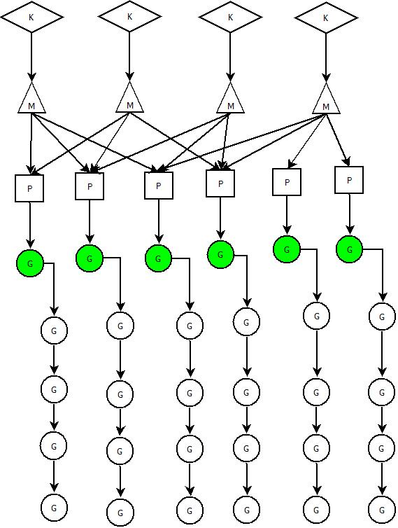

	Go语言在语言层面实现并发。Go编写一个并发编程程序很简单，只需要在函数调用之前使用一个`go`关键字即可启动一个goroutine执行并发。
虽然使用一个`go`关键字即可实现并发编程，但是是这个关键字的背后的实现非常复杂。

## 前导：并发与并行

通常说的并发编程，是指允许多个任务同时执行，但实际上并不一定在同一时刻被执行。在单核处理器上，通过多线程共享CPU时间片**串行执行**。而并行编程则依赖于多核处理器，让多个任务可以实现**并行执行**。

简单的说

- **并发** : 逻辑上同时处理多个任务。
- **并行** : 物理上同时处理多个任务。

## Go语言的并发模型。

Go语言的并发处理参考了CSP（Communicating Sequential Process）模型。CSP并发模型不同于传统的多线程通过共享内存来通信，CSP讲究的是“以通信的方式来共享内存”。

> Don’t communicate by sharing memory; share memory by communicating.
>
> 不要以共享内存的方式来通信，要通过通信来共享内存。

golang的CSP模型实现与原始的CSP实现有点差别：原始的CSP中channel里的任务都是立即执行的，而go语言为其增加了一个缓存，即任务可以先暂存起来，等待执行线程准备好再顺序执行。

## Go调度器

go语言运行时环境提供了非常强大的管理goroutine和系统内核线程的调度器， 内部提供了三种对象：Goroutine，Machine，Processor。

**Goroutine** : 指应用创建的goroutine **Machine** : 指系统内核线程。 **Processor** : 指承载多个goroutine的运行器

在宏观上说，Goroutine与Machine因为Processor的存在，形成了多对多（M:N）的关系。

## Goroutine

Goroutine是Go语言中并发的执行单位。 Goroutine底层是使用协程(coroutine)实现，coroutine是一种运行在用户态的用户线程（参考操作系统原理：内核态，用户态）**它可以由语言和框架层调度**。Golang在语言层面实现了调度器，同时对网络，IO库进行了封装处理，屏蔽了操作系统层面的复杂的细节，在语言层面提供统一的关键字支持。这样才实现了添加一个`go`关键字即可实现并发编程。

## Machine

Machine指go语言对一个关联的内核线程的封装。

## Processor

Processor是一个抽象的概念，代表了Machine所需的上下文环境，是处理用户级代码逻辑的处理器。

三者与内核级线程的关系如下图所示：

一个Machine会对应一个内核线程（K），同时会有一个Processor与它绑定。一个Processor连接一个或者多个Goroutine。Processor有一个运行时的Goroutine（上图中绿色的G），其它的Goroutine处于等待状态。

Processor的数量同时可以并发任务的数量，可通过GOMAXPROCS限制同时执行用户级任务的操作系统线程。GOMAXPROCS值默认是CPU的可用核心数，但是其数量是可以指定的。在go语言运行时环境，可以使用`runtime.GOMAXPROCS(MaxProcs)`来指定Processor数量。

## Go调度器调度过程

当一个Goroutine创建被创建时，Goroutine对象被压入**Processor的本地队列**或者**Go运行时 全局Goroutine队列**。Processor唤醒一个Machine，如果Machine的waiting队列没有等待被 唤醒的Machine，则创建一个（只要不超过Machine的最大值，10000），Processor获取到Machine后，与此Machine绑定，并执行此Goroutine。Machine执行过程中，随时会发生上下文切换。当发生上下文切换时，需要对执行现场进行保护，以便下次被调度执行时进行现场恢复。Go调度器中Machine的栈保存在Goroutine对象上，只需要将Machine所需要的寄存器(堆栈指针、程序计数器等)保存到Goroutine对象上即可。如果此时Goroutine任务还没有执行完，Machine可以将Goroutine重新压入Processor的队列，等待下一次被调度执行。 如果执行过程遇到阻塞并阻塞超时（调度器检测这种超时），Machine会与Processor分离，并等待阻塞结束。此时Processor可以继续唤醒Machine执行其它的Goroutine，当阻塞结束时，Machine会尝试”偷取”一个Processor，如果失败，这个Goroutine会被加入到全局队列中，然后Machine将自己转入Waiting队列，等待被再次唤醒。

在各个Processor运行完本地队列的任务时，会从全局队列中获取任务，调度器也会定期检查全局队列，否则在并发较高的情况下，全局队列的Goroutine会因为得不到调度而”饿死”。如果全局队列也为空的时候，会去分担其它Processor的任务，一次分一半任务，比如，ProcessorA任务完成了，ProcessorB还有10个任务待运行，Processor在获取任务的时候，会一次性拿走5个。（是不是觉得Processor相互之间很友爱啊 ^_^）。