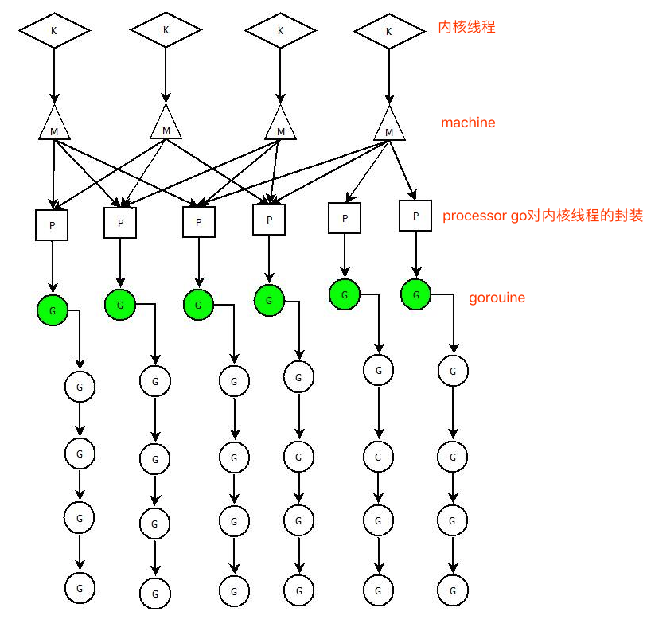

[TOC]

并发和并行的区别：

​	并发：同一时间段内执行多个任务

​	并行：同一时刻执行多个任务

# goroutine

- goroutine类似线程，属于用户态的线程
- goroutine是go语言的运行时(runtime)调度完成，而线程是由操作系统调度完成
- goroutine之间通信使用`channel`，goroutine和channel是go语言秉承的CSP并发模式的重要实现基础 (CSP讲究的是“`以通信的方式来共享内存,不要以共享内存的方式来通信`”)

## 启动一个goroutine

直接使用`go`关键字就能启动一个goroutine去执行函数

```go
func goroute(i int) {
	fmt.Println("hello", i)
	time.Sleep(time.Second)
}

func main() {
	go goroute(1)
	fmt.Println("main hello")
}
```

## 启动多个goroutine

### sync.WaitGroup线程等待

使用sync.WaitGroup方法来等待其他goroutine完成

```go
var wg sync.WaitGroup //引入sync.WaitGroup的方法

func goroute(i int) {
	defer wg.Done() //计数减一
	fmt.Println("hello", i)
	time.Sleep(time.Second)
}

func main() {
	wg.Add(2) //指定计数为2
	go func() {
		defer wg.Done()
		goroute(1)
		fmt.Println("匿名函数")
	}()
	wg.Wait() //等待计数为0，表示goroutine的线程都执行完成
	fmt.Println("main hello")
}
```

## goroutine与线程

### 可增长的栈

​		os线程(操作系统线程) 一般都有固定的栈内存（通常为2MB），一个gorouine的栈在其生命周期开始时只有很小的栈（2KB）,goroutine的栈不是固定的，他可以按需增大和缩小，goroutine的栈大小限制可以达到1GB，所有go语言一次创建10万左右的goroutine都是很正常的

### goroutine调度（GMP）

- Goroutine与Machine因为Processor的存在，形成了多对多（M:N）的关系。`把m个goroutine分配给n个操作系统线程`

- `GMP`是go语言运行时（runtime）层面的实现，是go语言自己实现的一套调度系统，区别于操作系统调度OS线程

> G    (goroutine)：就是一个goroutine，里面除了存放goroutine信息外，还与所在P的绑定信息。Goroutine底层是使用协程(coroutine)实现，coroutine是一种运行在用户态的用户线程（参考操作系统原理：内核态，用户态）**它可以由语言和框架层调度**。

> M   (machine)：go语言对一个关联的内核线程的封装。，M与内核线程一般是一一映射的关系，一个goroutine最终是要放到M上面执行的

> P    (Processor)：是一个抽象的概念，代表了Machine所需的上下文环境，是处理用户级代码逻辑的处理器。

下面是关系图解：



​		一个Machine会对应一个内核线程（K），同时会有一个Processor与它绑定。一个Processor连接一个或者多个Goroutine。Processor有一个运行时的Goroutine（上图中绿色的G），其它的Goroutine处于等待状态。

​		Processor的数量同时可以并发任务的数量，可通过GOMAXPROCS限制同时执行用户级任务的操作系统线程。GOMAXPROCS值默认是CPU的可用核心数，但是其数量是可以指定的。在go语言运行时环境，可以使用`runtime.GOMAXPROCS(MaxProcs)`来指定Processor数量。

### runtime.GOMAXPROCS

>Go运行时的调度器使用`GOMAXPROCS`参数来确定需要使用多少个OS线程来同时执行Go代码。

Go语言中可以通过`runtime.GOMAXPROCS()`函数设置当前程序并发时占用的CPU逻辑核心数

```go
func a() {
	for i := 1; i < 100; i++ {
		fmt.Println("A", i)
	}
}
func b() {
	for i := 1; i < 100; i++ {
		fmt.Println("B", i)
	}
}

//单核跑
func oneMain() {
	runtime.GOMAXPROCS(1)
	go a()
	go b()
	time.Sleep(time.Second)
}

//2核跑
func twoMain() {
	runtime.GOMAXPROCS(2)
	go a()
	go b()
	time.Sleep(time.Second)
}
func main() {
	oneMain()
	// twoMain()
}
```

### 操作系统线程和goroutine的关系

1. 一个操作系统线程对应用户态多个goroutine。
2. go程序可以同时使用多个操作系统线程。
3. goroutine和OS线程是多对多的关系，即m:n

# channel类型

​	**通道必须使用make函数初始化才能使用!!!**

```GO
var b chan int //定义一个名字为b的int类型chan
```

## 为啥需要channel

1. 通过channel实现多个goroutine之间的通信。

2. `CSP`:通过通信来共享内存。

## channel类型的操作符(<-)

- 发送：`ch1 <-1`
- 接收：`A<-ch1`
- 关闭：`close()`       chan关闭，不影响读取里面的内容

## 带缓冲的channel和不带缓冲的channel

> 无缓冲的channel要想发送值，必须有人接收值

```GO
var a []int
var b chan int
var wg sync.WaitGroup

func noBufChannel() {
	fmt.Println(b)     //<nil>    channel默认情况下是一个nil
	b = make(chan int) //为chan申请一块内存，返回一个指针
	wg.Add(1)
	go func() {
		defer wg.Done()
		x := <-b //b chan里面没有值，因此会hang在这里
		fmt.Println("后台goroutine从通道b中获取到了", x)
	}()
	b <- 10 //为管道b塞一个值
	fmt.Println("10发送到通道b中")
	wg.Wait()
}
func bufChannel() {
	fmt.Println(b)
	b = make(chan int, 10)
	b <- 10
	fmt.Println("10发送到通道b中")
	b <- 20
	fmt.Println("20发送到通道b中")
	x := <-b
	fmt.Println("从通道b中取出了一个值，赋值给", x)
	close(b)
	y := <-b //通道b关闭，不影响输出值
	fmt.Println("通道b关闭以后，从通道b中再取出一个值，", y)

}
func main() {
	noBufChannel()
	bufChannel()
}
```


## 单向通道

使用场景：

​		多用于函数传参，限制函数中通道的操作。

```go
// jobs <-chan int  只读类型的chan
// results chan<- int  只写类型的chan
func worker(id int, jobs <-chan int, results chan<- int) {
	for j := range jobs {
		fmt.Printf("worker:%d start job:%d\n", id, j)
		time.Sleep(time.Second)
		fmt.Printf("worker:%d end job:%d\n", id, j)
		results <- j * 2
	}
}
```

[goroutine和channel练习题](goroutine和channel练习题.md)

# 线程池

使用背景：

​		开启指定数量的goroutine在后台挂起，监听chan里面的数据变化，然后去处理数据，控制处理数据的线程数，防止`goroutine`泄漏和暴涨。

```go
// 使用goroutine实现生产者-消费者模型
// 1、开启一个线程池，后台挂起3个goroutine，读取chan里面的数据，处理完成后丢到另一个chan里面
// 2、开启多个任务给chan里面输入数据
// 3、打印处理完成的chan里面的数据

/*
知识点：
1、开启多个goroutine
2、利用生产数据输入chan，goroutine消费的概念实现
*/
func worker(id int, jobs <-chan int, results chan<- int) {
	for j := range jobs {
		fmt.Printf("worker:%d start job:%d\n", id, j)
		time.Sleep(time.Second)
		fmt.Printf("worker:%d end job:%d\n", id, j)
		results <- j * 2
	}
}

func workerMain() {
	jobs := make(chan int, 100)
	results := make(chan int, 100)
	//开启3个goroutine---消费者
	for i := 1; i <= 3; i++ {
		go worker(i, jobs, results)
	}
	//开启5个任务--生产者
	for j := 1; j <= 1000; j++ {
		jobs <- j
	}
	close(jobs)

	//输出结果---消费者
	for a := 1; a <= 5; a++ {
		fmt.Println(<-results)
	}
}
func main() {
	workerMain()
	// worker:1 start job:2
	// worker:2 start job:3
	// worker:3 start job:1
	// worker:2 end job:3
	// worker:3 end job:1
	// 6
	// 2
	// worker:2 start job:4
	// worker:3 start job:5
	// worker:1 end job:2
	// 4
	// worker:2 end job:4
	// 8
	// worker:3 end job:5
	// 10
}
```

# 多路复用（select）

使用背景：

​	在某种情况下可能需要同时从多个通道接收数据。通过在接受数据的时，如果没有数据，就会发生阻塞。可以考虑使用select来解决这个问题

```go
//这种也可以实现从多个通道接收值，但是运行性能会很差，所有引出select关键字来解决这个问题
for{
    // 尝试从ch1接收值
    data, ok := <-ch1
    // 尝试从ch2接收值
    data, ok := <-ch2
    …
}

//select解决去多个通道接收数据时，没有数据发生阻塞的问题
func main() {
	ch := make(chan int, 10)
	for i := 0; i < 10; i++ {
		select {
		case x := <-ch:
			fmt.Println(x)
		case ch <- i:
		}
	}
}
```

使用select的优点：

​	1、使用`select`语句能提高代码的可读性。

​	2、如果多个`case`同时满足，`select`会随机选择一个。

​	3、对于没有`case`的`select{}`会一直等待，可用于阻塞main函数。

## 空select{}

没有`case`的`select{}`会一直等待，用来阻塞main函数

