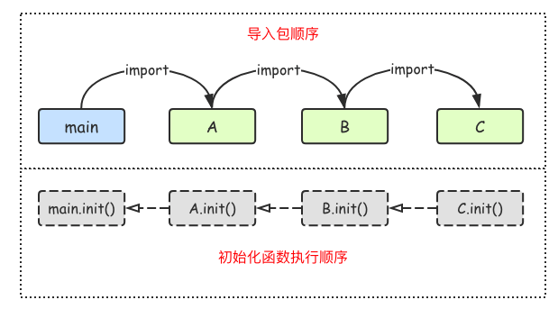

包

* 包的路径从`GOPATH/src`后面的路径开始写起,路径分隔符用`/`
* 想被别的包调用的标识符都要首字母大写!
* 单行导入和多行导入
* 导入包的时候可以指定别名
* 导入包不想使用包内部的标识符,需要使用匿名导入
* 每个包导入的时候会自动执行一个名为`init()`的函数,它没有参数也没有返回值也不能手动调用
* 多个包中都定义了`init()`函数,则它们的执行顺序见下图:

## 包嵌套详解

> 包嵌套，执行顺序如下图





## init函数

```go
package main
//随机数
import (
	"math/rand"
	"fmt"
	"time"
)
func init(){  //init函数主要做包初始化的
	rand.Seed(time.Now().UnixNano())
}
func main(){
	for i :=0;i <10;i++{
		a:=rand.Int()
		fmt.Println(a)
	}
	for i :=0;i <100;i++{
		a := rand.Intn(100)
		fmt.Println(a)
	}
	for i :=0;i <10;i++{
		a := rand.Float32()
		fmt.Println(a)
	}
} 
```