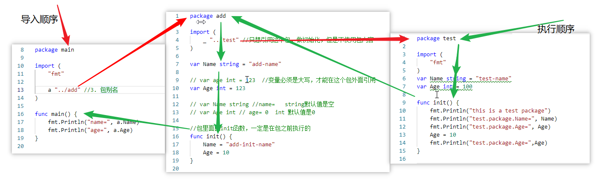

# 包嵌套详解
> 包嵌套，执行顺序如下图




## init函数
```go
package main
//随机数
import (
	"math/rand"
	"fmt"
	"time"
)
func init(){  //init函数主要做包初始化的
	rand.Seed(time.Now().UnixNano())
}
func main(){
	for i :=0;i <10;i++{
		a:=rand.Int()
		fmt.Println(a)
	}
	for i :=0;i <100;i++{
		a := rand.Intn(100)
		fmt.Println(a)
	}
	for i :=0;i <10;i++{
		a := rand.Float32()
		fmt.Println(a)
	}
} 
```