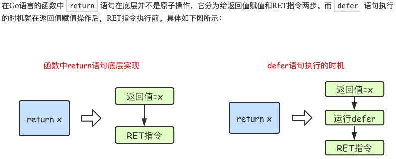

- [函数详解](#函数详解)
	- [函数的声明和注释](#函数的声明和注释)
	- [函数声明语法](#函数声明语法)
	- [函数特点](#函数特点)
		- [自定义函数类型](#自定义函数类型)
	- [函数参数传递的方式](#函数参数传递的方式)
	- [命名函数返回值的名称](#命名函数返回值的名称)
	- [可变参数](#可变参数)
		- [可变参数练习](#可变参数练习)
- [defer](#defer)
	- [defer的定义](#defer的定义)
	- [defer的用途](#defer的用途)
		- [关闭文件句柄](#关闭文件句柄)
		- [锁资源释放](#锁资源释放)
		- [数据库连接释放](#数据库连接释放)
	- [defer执行的时机](#defer执行的时机)
- [函数进阶](#函数进阶)
	- [变量的作用域](#变量的作用域)
	- [函数类型与变量](#函数类型与变量)
		- [定义函数类型](#定义函数类型)
		- [函数类型变量](#函数类型变量)
- [高阶函数](#高阶函数)
	- [函数作为参数](#函数作为参数)
	- [函数作为返回值](#函数作为返回值)
# 函数详解

## 函数的声明和注释

```go
1.函数声明：func 函数名称（参数列表）（返回值列表）{}
// 举例：
func add(){}
func add(a int,b int) int {}
func add(a int,b int) (int,int) {}

2.注释，俩种注释，单行注释：//和多行注释/**/
```

## 函数声明语法

    func 函数名（参数列表）[(返回值列表)]{}
```go
// example1 无参数，无返回值:
func add(){
}
// example2 有参数，没有返回值:
func add(a int,b int){
}
// example3 有参数，有返回值:
func add(a int,b int) int {
}
// example4 有参数，有多个返回值:
func add(a int,b int)(int,int){
}
// example5 有相同参数，有多个返回值:
func add(a,b int)(int,int){
}
// 命名的返回值就相当于在函数中声明一个变量
func f4(x int, y int) (ret int) {
	ret = x + y
	return // 使用命名返回值可以return后省略
}
// 可变长参数
// 可变长参数必须放在函数参数的最后
func f7(x string, y ...int) { //y是一个slice，可以通过y[索引]访问slice里面的任意参数
	fmt.Println(x)
	fmt.Println(y) // y的类型是切片 []int
}
```
## 函数特点
```
golang函数特点：
1. 不支持重载，一个包不能有俩个一样名字的函数
2. 函数是一等公民，函数也是一种类型，一个函数可以赋值给变量
3. 匿名函数
4. 多返回值
```
### 自定义函数类型
```go
package main

import "fmt"

// 1、函数是可以赋值给一个变量的
func add(a, b int) int {
	return a + b
}
func func1_main() {
	c := add
	fmt.Println(c)   //这个变量打印出来的值就是一个地址
	sum := c(10, 20) //可以直接为c这个变量添加参数进行获取函数返回的结果
	fmt.Println(sum)
}

// 2、自定义函数类型
//1-// type op_func func(int, int) int //自定义一个函数类型op_func，传入值为int,int，返回值为int

func add2(a, b int) int {
	return a - b
}

//1-// func operator(op op_func, a, b int) int {
func operator(op func(int, int) int, a, b int) int { //也可以使用把函数当做类型传入
	return op(a, b)
}
func func2_main() {
	c := add2
	sum2 := operator(c, 100, 2000) //传入函数，和俩个值
	fmt.Println(sum2)
}

func main() {
	func1_main()
	func2_main()
}

```
## 函数参数传递的方式
>值传递、引用传递（map,clice,chan,指针,interface默认是引用传递）

**注意：**
1. 无论是值传递，还是引用传递，传递给函数的都是变量的副本。
2. 值传递是值的拷贝，引用传递是地址的拷贝
3. 地址拷贝更为高效，而值拷贝取决于拷贝对象的大小，对象越大，性能越低
## 命名函数返回值的名称

	注意：返回值定义了变量，在函数体就无需定义相同的变量了，可以直接去赋值
```go
func add(a int, b int) (c int) { //可以在返回值定义变量
	c = a + b //这里c就不用定义了，直接赋值
	return
}
func calc(a, b int) (sum int, avg int) {
	sum = a + b
	avg = (a + b) / 2
	return
}

func main() {
	add1 := add(10, 20)
	calc1, _ := calc(100, 200)  //_标识符，用来忽略返回值
	fmt.Println(add1, calc1)
}
```
## 可变参数

```go
func add(arg...int) int{} //0个或者多个参数，arg是个自定义名字

func add(a int,arg...int) int{} //1个或者多个参数

func add(a int,b int,arg...int) int() //2个或者多个参数
注意：其中arg是一个slice，我们可以通过arg[index]依次访问所有参数，通过len(arg)来判断传递参数的个数。
```
### 可变参数练习
```go
package main

import "fmt"
//14、写一个函数add,支持1个或多个int相加，并返回相加结果
func adds(a int, bs ...int) (sum int) {
	sum = a
	for i := 0; i < len(bs); i++ {
		sum = sum + bs[i]
	}
	return
}
func sums_main() {
	sums := adds(1, 123, 123, 43, 412)
	fmt.Println(sums)
}

//15、写一个concat，支持1个或者多个string相拼接，并返回结果
func concat(a string, bs ...string) (concats string) {
	concats = a
	for i := 0; i < len(bs); i++ {
		concats = concats + bs[i]
	}
	return
}
func concat_main() {
	concats := concat("lll", "qqq", "xxx", "www")
	fmt.Println(concats)
}
func main() {
	sums_main()
	concat_main()
}
```
# defer

## defer的定义

1. 当函数返回时，执行defer语句，因此，可以用来做资源清理
2. 多个defer语句，按先进后出的方式执行
3. defer语句中的变量，在defer声明时就决定了

```go
package main
import ("fmt")
func defer1() {
	var i int = 0
	defer fmt.Println(i)        //函数执行完后才执行,因此defer的执行结果是0，而不是10，第二执行
	defer fmt.Println("second") //执行顺序，函数返回结果后，第一执行，遵守先进后出的原则
	i = 10
	fmt.Println(i)
}
func main() {
	defer1()
}
```


## defer的用途

### 关闭文件句柄

```go
func read(){
	file := open(filename)
	defer file.Close()
	//文件操作
}
```
### 锁资源释放
```go
func read(){
	mc.Lock()
	defer mc.Unlock()
	//其他操作
}
```
### 数据库连接释放

```go
func read(){
	conn := openDatabase()
	defer conn.Close()
}
```
## defer执行的时机

> go语言中函数的return不是原子操作，在底层是分为俩步来执行的
>
> 第一步：返回值赋值
>
> 第二部：真正的return返回
>
> 函数中如果存在defer，那么defer执行的时机是在第一步和第二步之间



```go
func calc(index string, a, b int) int {
	ret := a + b
	fmt.Println(index, a, b, ret)
	return ret
}

func main() {
	a := 1
	b := 2
	defer calc("1", a, calc("10", a, b)) //携带全部变量的状态，也就是说直接拷贝对应的值传入函数，但是不执行
	a = 0
	defer calc("2", a, calc("20", a, b))
	b = 1
}

// 1. a:=1
// 2. b:=2
// 3. defer calc("1", 1, calc("10", 1, 2))  
// 4. calc("10", 1, 2) // "10" 1 2 3
// 5. defer calc("1", 1, 3)
// 6. a = 0
// 7. defer calc("2", 0, calc("20", 0, 2))
// 8. calc("20", 0, 2) // "20" 0 2 2
// 9. defer calc("2", 0, 2)
// 10. b = 1
// calc("2", 0, 2) // "2" 0 2 2
// calc("1", 1, 3) // "1" 1 3 4

// 最终的答案：
// "10" 1 2 3
// "20" 0 2 2
//  "2" 0 2 2
// "1" 0 3 3
```


# 函数进阶

##  变量的作用域

- 在函数内部声明的变量叫做局部变量，生命周期仅限于函数内部
- 在函数外部声明的变量叫做全局变量，生命周期作用于整个包，如果是大写的，则作用于整个程序 

## 函数类型与变量

### 定义函数类型

### 函数类型变量

```GO
//定义一个calculation类型，是一种函数类型，这种函数接收俩个int类型参数，返回一个int类型参数
type calculation func(int,int) int

//add 和sub都是calculation类型
func add(x, y int) int {
	return x + y
}
func sub(x, y int) int {
	return x - y
}

// add和sub都能赋值给calculation类型的变量
var c calculation
c =add

//执行c这个函数类型，并且传参执行，返回结果
func main() {
	var c calculation               // 声明一个calculation类型的变量c
	c = add                         // 把add赋值给c
	fmt.Printf("type of c:%T\n", c) // type of c:main.calculation
	fmt.Println(c(1, 2))            // 像调用add一样调用c

	f := add                        // 将函数add赋值给变量f1
	fmt.Printf("type of f:%T\n", f) // type of f:func(int, int) int
	fmt.Println(f(10, 20))          // 像调用add一样调用f
}
```

# 高阶函数

> 高阶函数分为函数作为参数和函数作为返回值两部分

## 函数作为参数

```go
func add(x, y int) int {
	return x + y
}
// op func(int, int) int)  参数名op，类型func(int, int), 返回类型int
func calc2(x, y int, op func(int, int) int) int {  //传入一个函数需要写上（传参，返回值类型）
	return op(x, y)
}

func calc2Main() {
	c := calc2(1, 2, add)
	fmt.Println(c) //3
}
```


## 函数作为返回值

```GO
func add(x, y int) int {
	return x + y
}
func sub(x, y int) int {
	return x - y
}
func do(s string) (func(int, int) int, error) { //返回一个函数（返回的函数需要写上传参，返回值类型），一个报错
	switch s {
	case "+":
		return add, nil
	case "-":
		return sub, nil
	default:
		err := errors.New("无法识别的操作符")
		return nil, err
	}
  
  
  
//传入参数int类型的a,b
//传入参数 "func(int, int) int" 类型的adds
//传入参数 "func(int, int) int" 类型的subs
//返回一个 “func(int, int) int” 类型
func as2(a, b int, adds func(int, int) int, subs func(int, int) int) func(int, int) int {
	fmt.Println(a, b, adds(a, b), subs(a, b))
	return adds
}
func as2Main(){
	abc := as2(1, 2, add, sub) //传入add,sub俩个函数，然后返回一个函数叫abc
	abc(2, 3) //执行abc这个函数
}
```


