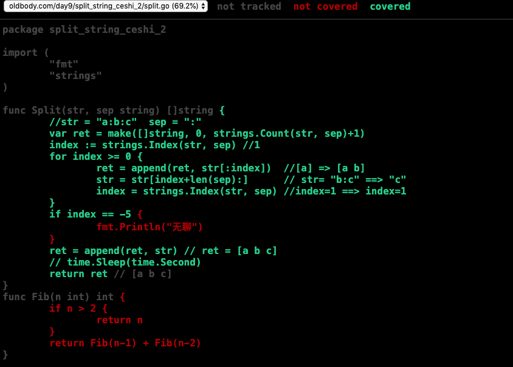

[TOC]

# go test工具


> go test命令是一个按照一定约定和组织的测试代码的驱动程序。在包目录内，所有以`_test.go`为后缀名的源代码文件都是`go test`测试的一部分，不会被`go build`编译到最终的可执行文件中。

在`*_test.go`文件中有三种类型的函数，单元测试函数、基准测试函数和示例函数。

|   类型   |         格式          |              作用              |
| :------: | :-------------------: | :----------------------------: |
| 测试函数 |   函数名前缀为Test    | 测试程序的一些逻辑行为是否正确 |
| 基准函数 | 函数名前缀为Benchmark |         测试函数的性能         |
| 示例函数 |  函数名前缀为Example  |       为文档提供示例文档       |

`go test`命令会遍历所有的`*_test.go`文件中符合上述命名规则的函数，然后生成一个临时的main包用于调用相应的测试函数，然后构建并运行、报告测试结果，最后清理测试中生成的临时文件。

# 测试函数

## 测试示例：

```go
package split_string

import (
	"reflect"
	"testing"
)
//被测函数：
func Split(str, sep string) []string {
	//str = "a:b:c"  sep = ":"
	var ret = make([]string, 0, strings.Count(str, sep)+1)
	index := strings.Index(str, sep) //1
	for index >= 0 {
		ret = append(ret, str[:index])  //[a] => [a b]
		str = str[index+len(sep):]      // str= "b:c" ==> "c"
		index = strings.Index(str, sep) //index=1 ==> index=1
	}
	if index == -5 {
		fmt.Println("无聊")
	}
	ret = append(ret, str) // ret = [a b c]
	// time.Sleep(time.Second)
	return ret // [a b c]
}


//测试函数-1
func TestSplit(t *testing.T) { 
	//返回值
	ret := Split("abadsfqw", "b")
	//期望返回的值
	want := []string{"a", "adsfqw"}
	//判断俩个引用类型是否相同使用reflect.DeepEqual()
	if !reflect.DeepEqual(ret, want) {
		//测试用例失败
		t.Errorf("want:%v got:%v\n", want, ret)
	}
}

//测试函数-2
func Test2Split(t *testing.T) {
	ret := Split("a:b:c", ":")
	want := []string{"a", "b", "dc"}
	if !reflect.DeepEqual(ret, want) {
		// 测试用例失败了
		t.Errorf("want:%v but got:%v\n", want, ret)
	}
}

```

执行命令：`go test -v `

```go
liuqixiangdeMacBook-Pro:split_string liuqixiang$ go test  -v 
=== RUN   TestSplit
--- PASS: TestSplit (0.00s)
=== RUN   Test2Split
--- FAIL: Test2Split (0.00s)
    split_test.go:27: want:[a b dc] but got:[a b c]
FAIL
exit status 1
FAIL    oldbody.com/day9/split_string   0.005s
```

## 测试组

```go
//测试组
func TestSplitGroup(t *testing.T) {
	//定义测试用例
	type testCase struct {
		str  string
		sep  string
		want []string
	}
	//定义测试用例列表
	testGroup := []testCase{
		testCase{"babcbef", "b", []string{"", "a", "c", "ef"}},
		testCase{"a:b:c", ":", []string{"a", "b", "c"}},
		testCase{"abcef", "bc", []string{"a", "aef"}},
		testCase{"沙河有沙又有河", "有", []string{"沙河", "沙又", "河"}},
	}
  //循环获取用例，测试
	for _, tc := range testGroup {
		ret := Split(tc.str, tc.sep)
		if !reflect.DeepEqual(ret, tc.want) {
			t.Errorf("want:%v got:%v\n", tc.want, ret)
		}
	}
}
```

执行命令：`go test -v`

```go
liuqixiangdeMacBook-Pro:split_string_ceshi_2 liuqixiang$ go test  -v 
=== RUN   TestSplitGroup
--- FAIL: TestSplitGroup (0.00s)
    split_test.go:26: want:[a aef] got:[a ef]
FAIL
exit status 1
FAIL    oldbody.com/day9/split_string_ceshi_2   0.005s
```

## 子测试

> 就是可以跑单个测试用例，也可以全部都跑

```go
//子测试组
func TestSplitGroup(t *testing.T) {
	//定义测试用例
	type testCase struct {
		str  string
		sep  string
		want []string
	}
	//定义测试用例列表
	testGroup := map[string]testCase{
		"case_0": testCase{"babcbef", "b", []string{"", "a", "c", "ef"}},
		"case_1": testCase{"a:b:c", ":", []string{"a", "b", "c"}},
		"case_2": testCase{"abcef", "bc", []string{"a", "aef"}},
		"case_3": testCase{"沙河有沙又有河", "有", []string{"沙河", "沙又", "河"}},
	}
	for name, tc := range testGroup {
		//可以通过--run="" 指定测试用例，只跑单个用例
		t.Run(name, func(t *testing.T) {
			ret := Split(tc.str, tc.sep)
			if !reflect.DeepEqual(ret, tc.want) {
				t.Errorf("want:%v got:%v\n", tc.want, ret)
			}
		})
	}
}
```

执行命令：`go test -v`

```go
liuqixiangdeMacBook-Pro:split_string_ceshi_2 liuqixiang$ go test  -v 
=== RUN   TestSplitGroup
=== RUN   TestSplitGroup/case_0
=== RUN   TestSplitGroup/case_1
=== RUN   TestSplitGroup/case_2
=== RUN   TestSplitGroup/case_3
--- FAIL: TestSplitGroup (0.00s)
    --- PASS: TestSplitGroup/case_0 (0.00s)
    --- PASS: TestSplitGroup/case_1 (0.00s)
    --- FAIL: TestSplitGroup/case_2 (0.00s)
        split_test.go:28: want:[a aef] got:[a ef]
    --- PASS: TestSplitGroup/case_3 (0.00s)
FAIL
exit status 1
FAIL    oldbody.com/day9/split_string_ceshi_2   0.006s
```

执行命令：`go test  -v --run="TestSplitGroup/case_3"`

```go
liuqixiangdeMacBook-Pro:split_string_ceshi_2 liuqixiang$ go test  -v --run="TestSplitGroup/case_3"
=== RUN   TestSplitGroup
=== RUN   TestSplitGroup/case_3
--- PASS: TestSplitGroup (0.00s)
    --- PASS: TestSplitGroup/case_3 (0.00s)
PASS
ok      oldbody.com/day9/split_string_ceshi_2   0.005s
```

### 子测试的Setup和Teardown


## 测试覆盖率

**三种方式展现：**

执行命令：`go test  --cover`

```
liuqixiangdeMacBook-Pro:split_string_ceshi_2 liuqixiang$ go test  --cover 
--- FAIL: TestSplitGroup (0.00s)
    --- FAIL: TestSplitGroup/case_2 (0.00s)
        split_test.go:28: want:[a aef] got:[a ef]
FAIL
coverage: 69.2% of statements
exit status 1
FAIL    oldbody.com/day9/split_string_ceshi_2   0.004s
```

执行命令：`go tool cover -html=c.out` 生成html页面



执行命令：`go test -cover -coverprofile=c.out` 测试结果输出到文件中


# 基准测试

## 性能基准测试

```go
// 基准测试
func BenchmarkSplit(b *testing.B) {
	//b.N是一个动态的值，保证函数执行的时间大于1s
	for i := 0; i < b.N; i++ { //循环b.N次
		Split("a:b:c", ":")
	}
}
```

执行命令：`go test -bench=Split`

```go
liuqixiangdeMacBook-Pro:split_string_jzceshi_3 liuqixiang$  go test -bench=Split
goos: darwin //系统
goarch: amd64 //版本
pkg: oldbody.com/day9/split_string_jzceshi_3 //包
BenchmarkSplit-8        20000000                90.6 ns/op  
// BenchmarkSplit-8表示对Split函数进行基准测试，数字8表示GOMAXPROCS的值
// 20000000 调用次数
// 90.6 ns/op  平均每次的调用时间
PASS
ok      oldbody.com/day9/split_string_jzceshi_3 1.913s  //执行的时间
```

执行命令：`go test -bench=Split -benchmem`

```go
liuqixiangdeMacBook-Pro:split_string_jzceshi_3 liuqixiang$  go test -bench=Split -benchmem
goos: darwin
goarch: amd64
pkg: oldbody.com/day9/split_string_jzceshi_3
BenchmarkSplit-8        20000000                93.1 ns/op            48 B/op          1 allocs/op
// BenchmarkSplit-8表示对Split函数进行基准测试，数字8表示GOMAXPROCS的值
// 20000000 调用次数
// 90.6 ns/op  平均每次的调用时间
// 48 B/op 平均每次调用使用的内存
// 1 allocs/op 一共分配了几次内存
PASS
ok      oldbody.com/day9/split_string_jzceshi_3 1.965s
```

## 性能测试比较

>上面的基准测试只能得到给定操作的绝对耗时，但是在很多性能问题是发生在两个不同操作之间的相对耗时，比如同一个函数处理1000个元素的耗时与处理1万甚至100万个元素的耗时的差别是多少？再或者对于同一个任务究竟使用哪种算法性能最佳？我们通常需要对两个不同算法的实现使用相同的输入来进行基准比较测试。

```go
//实例函数-斐波那契数列
func Fib(n int) int {
	if n < 2 {
		return n
	}
	return Fib(n-1) + Fib(n-2)
}

//性能比较测试
func benchmarkFib(b *testing.B, n int) {
	for i := 0; i < b.N; i++ {
		Fib(n)
	}
}

func BenchmarkFib1(b *testing.B)  { benchmarkFib(b, 1) }
func BenchmarkFib3(b *testing.B)  { benchmarkFib(b, 3) }
func BenchmarkFib10(b *testing.B) { benchmarkFib(b, 10) }
```

执行命令：`go test -bench=.`

```go
liuqixiangdeMacBook-Pro:split_string_jzceshi_3 liuqixiang$ go test -bench=.
goos: darwin
goarch: amd64
pkg: oldbody.com/day9/split_string_jzceshi_3
BenchmarkFib1-8         2000000000               1.92 ns/op
BenchmarkFib3-8         200000000                9.23 ns/op
BenchmarkFib10-8         5000000               340 ns/op
PASS
ok      oldbody.com/day9/split_string_jzceshi_3 8.907s
```

# 示例函数

> 被`go test`特殊对待的第三种函数就是示例函数，它们的函数名以`Example`为前缀。它们既没有参数也没有返回值。标准格式如下：
>

```go
func ExampleName() {
     // ...
}
```

