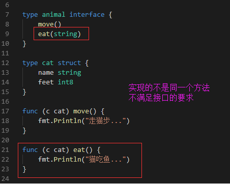
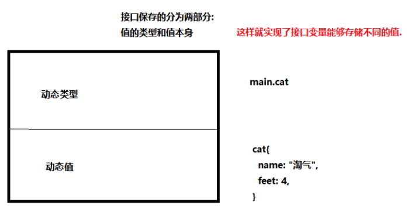

- [接口](#接口)
	- [接口解决的问题-实例](#接口解决的问题-实例)
	- [接口的定义](#接口的定义)
	- [接口的实现的条件](#接口的实现的条件)
	- [使用值接受者实现接口与使用指针接受者实现接口的区别](#使用值接受者实现接口与使用指针接受者实现接口的区别)
	- [接口底层](#接口底层)
	- [接口和类型的关系](#接口和类型的关系)
		- [一个接口对应多个结构体](#一个接口对应多个结构体)
		- [接口可以嵌套](#接口可以嵌套)
	- [空接口](#空接口)
		- [空接口定义和使用](#空接口定义和使用)
		- [空接口做类型断言](#空接口做类型断言)
# 接口

接口定义了一个对象的行为规范，只定义规范不实现，由具体的对象来实现规范的细节

`关于接口需要注意的是，只有当有两个或两个以上的具体类型必须以相同的方式进行处理时才需要定义接口。不要为了接口而写接口，那样只会增加不必要的抽象，导致不必要的运行时损耗`

## 接口解决的问题-实例

```go
//引入接口，接口解决的问题
//定义一个接口类型

type speaker interface {
	speak() //只要实现了speak方法的变量都刷speaker类型，方法名
}

type cat struct{}
type dog struct{}

func (c cat) speak() {
	fmt.Println("喵喵喵～")
}
func (d dog) speak() {
	fmt.Println("汪汪汪～")
}

func da(x speaker) { //定义了一个接口类型的方法，可以传进来任何带有这个接口方法的值
	//可以接收任何参数，传进来什么，就执行他的方法
	x.speak()
}
func main() {
	var c1 cat
	var d1 dog
  //要想执行c1的speak方法。需要c1.speak()
  //要想执行d1的speak方法。需要d1.speak(),那么如何做一个可以传入多种实例执行相同的方法那？
  
  //定义了一个da(x speaker)的方法，只需要把需要执行speak的实例传进来就能执行对应的方法了
	da(c1)
	da(d1)
	var ss speaker //定义了一个接口类型的变量
	ss = c1
	ss.speak()
	ss = d1
	ss.speak()
}

```

## 接口的定义

1. 接口名：使用type将接口定义为自定义的类型名。go语言的接口在命名时，一般会在单词后面添加er，接口名最好能突出该接口的类型含义
2. 方法名： 当方法名首字母是大写且这个接口类型名首字母也是大写时，这个方法可以被接口所在的包之外的代码进行调用访问
3. 参数列表/返回值列表：参数列表和返回值列表中的参数变量名可以省略

```go
type 接口类型名 interface{
    方法名1( 参数列表1 ) 返回值列表1
    方法名2( 参数列表2 ) 返回值列表2
    …
}
//举例：定义了一个writer的接口类型，里面有Write的方法，需要传入[]byte类型的值，返回一个error
type writer interface{
  Write([]byte) error
}

```

## 接口的实现的条件

> 一个对象只要全部实现了接口中的方法，那么就实现了这个接口了。





## 使用值接受者实现接口与使用指针接受者实现接口的区别

- 使用值接收者实现接口，结构体类型和结构体指针类型的变量都能存
- 指针接受者实现接口，只能存结构体指针类型的变量

```go
//使用值接受者和指针接受者的区别？
type animal interface {
	move()
	eat(string)
}
type cat struct {
	name string
	feet int8
}

// 使用值接受者实现了接口的所有方法
// func (c cat) move() {
// 	fmt.Println("走猫步。。")
// }
// func (c cat) eat(food string) {
// 	fmt.Printf("猫吃%s\n", food)
// }

//使用指针接受者实现了接口的所有方法
//move、eat都属于*cat的方法，所以传入的都应该是指针
func (c *cat) move() {
	fmt.Println("走猫步。。")
}
func (c *cat) eat(food string) {
	fmt.Printf("猫吃%s...\n", food)
}

func main() {
	var a1 animal
	c1 := cat{"tom", 4} //cat
	c2 := &cat{"假猫", 4} //*cat

	a1 = &c1 //实现animal这个接口的是cat的指针类型
	fmt.Println(a1)
	a1 = c2
	fmt.Println(a1)
}
```

## 接口底层

- 动态类型
- 动态值


## 接口和类型的关系

### 一个接口对应多个结构体

### 接口可以嵌套

```go
//同一个结构体可以实现多个接口
//接口还可以进行嵌套

//定义一个嵌套接口
type animal interface {
	mover
	eater
}

//定义一个mover接口和eater接口
type mover interface {
	move()
}
type eater interface {
	eat(string)
}
type cat struct {
	name string
	feet int8
}

// cat实现了mover接口
func (c *cat) move() {
	fmt.Printf("%s,走猫步。。。\n", c.name)
}

// cat实现了eater接口
func (c *cat) eat(food string) {
	fmt.Printf("%s,吃%s\n", c.name, food)
}
func main() {
	bc := cat{
		name: "蓝猫",
		feet: 4,
	}
	rc := cat{
		name: "红猫",
		feet: 4,
	}
	var eat eater
	eat = &bc
	eat.eat("渔") //蓝猫,吃渔

	var move mover
	move = &rc
	move.move() //红猫,走猫步。。。

	var an animal
	an = &bc
	an.move()    //蓝猫,走猫步。。。
	an.eat("老鼠") //蓝猫,吃老鼠
	an = &rc
	an.move()    //红猫,走猫步。。。
	an.eat("老鼠") //红猫,吃老鼠
}
```

## 空接口

>所有的类型都实现了空接口.也就是任意类型的变量都能保存到空接口中.

```go
interface{} // 空接口
```

### 空接口定义和使用

```GO
// 空接口

// interface: 关键字
// interface{}: 空接口类型

//空接口作为函数参数
func show(a interface{}) {
	fmt.Printf("type:%T, value:%v\n", a, a)
}
func main() {
	var m1 map[string]interface{}
	m1 = make(map[string]interface{}, 20)
	m1["name"] = "周林"
	m1["age"] = 9000
	m1["merried"] = true
	m1["hobby"] = [...]string{"唱", "跳", "rap"}
	fmt.Println(m1)

	show(false) //type:bool, value:false
	show(nil)   //type:<nil>, value:<nil>
	show(m1) //type:map[string]interface {}, value:map[age:9000 hobby:[唱 跳 rap] merried:true name:周林]
}
```

### 空接口做类型断言

```go
//类型断言1
func assign(a interface{}) {
	fmt.Printf("%T\n", a)
	str, ok := a.(string)
	if !ok {
		fmt.Printf("不对\n")
	} else {
		fmt.Printf("传进来是一个字符串：%s\n", str)
	}
}

// 类型断言2
func assign2(a interface{}) {
	fmt.Printf("%T\n", a)
	switch t := a.(type) {
	case string:
		fmt.Println("是一个字符串:", t)
	case int:
		fmt.Println("是一个int:", t)
	case int64:
		fmt.Println("是一个int64:", t)
	case bool:
		fmt.Println("是一个bool:", t)
	case []int:
		fmt.Println("是一个slice:", t)
	case map[string]int:
		fmt.Println("是一个map[string]int:", t)
	case func():
		fmt.Println("是一个函数类型:", t)
	}
}
func f() {}
func main() {
	assign(1)
	// assign(100)
	assign2(true)
	assign2("哈哈哈")
	assign2(int64(200))
	assign2([]int{1, 2, 3})
	assign2(map[string]int{"a": 1})
	assign2(f)
}
```

