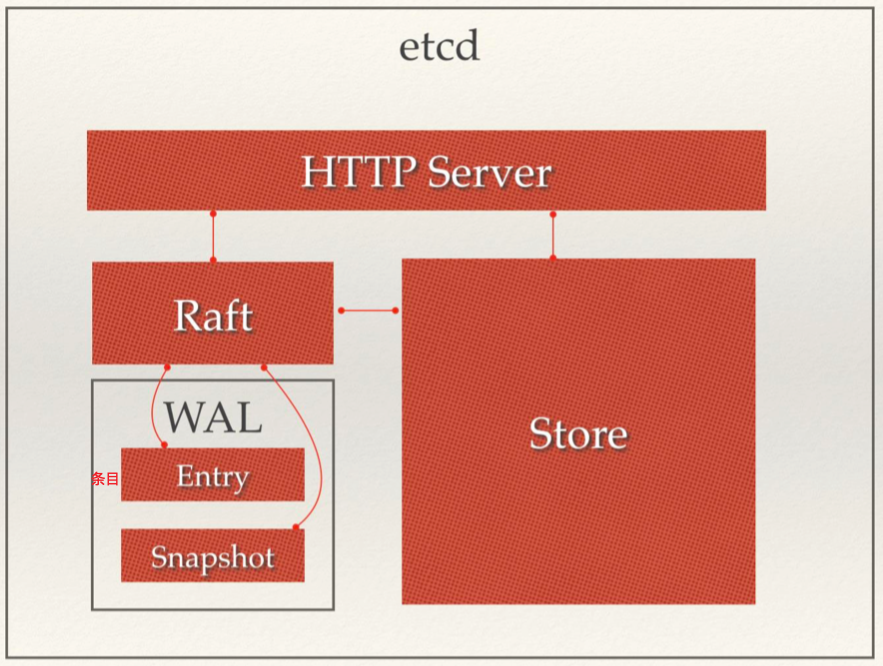

[TOC]

# Etcd介绍

​	etcd高可用的分布式key-value存储系统，可以用于共享和服务的注册和发现

## etcd的特点

- 完全复制：集群中的每个节点都可以使用完整的存档
- 高可用性：etcd可用于避免硬件的单点故障或网络问题
- 一致性：每次读取都会返回跨多主机的最新写入
- 简单：包括一个定义良好、面向用户的api（grpc）
- 安全：实现了带有可选的客户端证书身份验证的自动化TLS
- 快速：每秒10000此写入的基准速度
- 可靠：使用raft算法实现了强一致、高可用的服务存储目录

## 使用场景

- 服务发现

- 配置中心

- 分布式锁

  因为etcd使用raft算法保持了数据的强一致性，某次操作存储到集群中的值必然是全局一致的，所以很容易实现分布式锁。锁服务有俩种使用方式，一是保持独占，二是控制时序

  1. **保持独占即所有获取锁的用户最终只有一个可以得到。**etcd为此提供了一套实现分布式锁，原子操作CAS的api，通过设置`	prevExist`值，可以保证在多个节点同时去创建魔鬼目录时，只有一个成功。而创建成功的用户就可以认为是获取到锁了。
  2. 控制时序，即所有想要获得锁的用户都会被安排执行，但是**获得锁的顺序也是全局唯一的，同时决定了执行顺序**。etcd为此提供了一套api（自动创建有序键），对一个目录键值时指定为post动作，这样etcd会自动在目录下生成一个当前最大的值为键，存储这个新的值（客户端编号）。同时还可以使用api按顺序列出所有当前目录下的键值。此项这些键值就是客户端的时序，而这些键中存储的值可以是代表的客户端的编号

## etcd架构



从etcd的架构图可以看出，etcd分四部分：

1. http server：用于处理用户发送的api请求以及其他etcd节点的同步与心跳信息请求
2. store：用于处理etcd支持的各类功能的事务，包括数据索引、节点状态变更、监控与反馈、事件处理与执行等，是etcd对用户提供的大多数api功能的具体体现
3. raft：raft强一致性算法的具体实现，是etcd的核心
4. wal：write ahead log（预写式日志），是etcd的数据存储方式。除了在内存中存储所有数据的状态以及节点的索引以外，etcd就通过wal进行持久化存储。wal中，所有的数据提交前都或事先记录日志。snapshot是为了防止数据过多而进行的状态快照；entry表示存储的具体日志内容

## etcd集群部署

```shell
TOKEN=token-01  #集群之间通信的token
CLUSTER_STATE=new #集群状态
CLUSTER=n1=http://10.240.0.17:2380,n2=http://10.240.0.18:2380,n3=http://10.240.0
.19:2380  #集群的节点名称和通信地址

#每个节点的启动配置
etcd --data-dir=data.etcd \
		--name n1 \ #节点名称
    --initial-advertise-peer-urls http://10.240.0.17:2380 \ #通信监听地址和端口
    --listen-peer-urls http://10.240.0.17:2380 \
    --advertise-client-urls http://10.240.0.17:2379 \ #客户端监听地址和端口
    --listen-client-urls http://10.240.0.17:2379 \
    --initial-cluster ${CLUSTER} \
    --initial-cluster-state ${CLUSTER_STATE} \
    --initial-cluster-token ${TOKEN}
```

### 官方支持外网访问集群

```shell
# 通过获取一个密钥串
curl https://discovery.etcd.io/new?size=3
# 返回的结果：
https://discovery.etcd.io/a81b5818e67a6ea83e9d4daea5ecbc92


#在每个节点上都加上这个密钥串
DISCOVERY=https://discovery.etcd.io/a81b5818e67a6ea83e9d4daea5ecbc92
 --discovery ${DISCOVERY} \
```

### 客户端基本操作

```shell
export ETCDCTL_API=3
HOST_1=10.240.0.17
HOST_2=10.240.0.18
HOST_3=10.240.0.19
ENDPOINTS=$HOST_1:2379,$HOST_2:2379,$HOST_3:2379
etcdctl --endpoints=$ENDPOINTS member list

# put:
etcdctl.exe --endpoints=http://127.0.0.1:2379 put key value
# get:
etcdctl.exe --endpoints=http://127.0.0.1:2379 GET key
# del:
etcdctl.exe --endpoints=http://127.0.0.1:2379 DEL key
```

# 操作etcd

`go.etcd.io/etcd/clientv3`

## get/put/delete

```go
package main

import (
	"context"
	"fmt"
	"go.etcd.io/etcd/clientv3"
  // "go.etcd.io/etcd/pkg/transport" //自带的证书配置包
	"time"
)

func main() {
	// 使用证书
	//tlsinfo :=transport.TLSInfo{
	//	CertFile:           "./etcd.pem",
	//	KeyFile:            "./etcd-key.pem",
	//	CAFile:             "",
	//	TrustedCAFile:      "./ca.pem",
	//	ClientCertAuth:     false,
	//	CRLFile:            "",
	//	InsecureSkipVerify: false,
	//	ServerName:         "",
	//	HandshakeFailure:   nil,
	//	CipherSuites:       nil,
	//	AllowedCN:          "",
	//}
	//config,err:=tlsinfo.ClientConfig()
	//if err!=nil{
	//	fmt.Println("解析证书失败：err:",err)
	//}
	cli, err := clientv3.New(clientv3.Config{
		Endpoints:   []string{"127.0.0.1:2379"},
		DialTimeout: 5 * time.Second,
		//TLS:config,
	})
	if err != nil {
		fmt.Printf("connect to etcd failed,err:%#v\n", err)
		return
	}
	fmt.Println("connect to etcd success")
	defer cli.Close()
  
	// put
	ctx,cancel := context.WithTimeout(context.Background(),time.Second)
	_,err = cli.Put(ctx,"liuqixiang","28")
	if err !=nil {
		fmt.Println("put one key is err:",err)
	}
	cancel()

	//get
	ctx,cancel = context.WithTimeout(context.Background(),time.Second)
	resp,err:= cli.Get(ctx,"liuqixiang")
	cancel()
	if err != nil {
		fmt.Printf("get from etcd failed, err:%v\n", err)
		return
	}
	cancel()
	for _,e := range resp.Kvs{
		fmt.Printf("%s,%s\n",e.Key,e.Value)
	}
  //delete 
  ctx,cancel = context.WithTimeout(context.Background(), time.Second*1)
	delres,err:=cli.Delete(ctx,"")
	cancel()
	if err != nil {
		fmt.Printf("get from etcd failed, err:%v\n", err)
		return
	}
	fmt.Println(delres.Deleted) //影响的key的数量
	// get 全部的key
	ctx,cancel = context.WithTimeout(context.Background(), time.Second*1)
	resp, err = cli.Get(ctx, "",clientv3.WithPrefix())
	cancel()
	if err != nil {
		fmt.Printf("get from etcd failed, err:%v\n", err)
		return
	}
	for _, ev := range resp.Kvs {
		fmt.Printf("%s,%s\n", ev.Key,ev.Value)
	}
}
```

## watch

```go
package main

import (
	"context"
	"fmt"
	"go.etcd.io/etcd/clientv3"
	"time"
)

func main() {
	cli, err := clientv3.New(clientv3.Config{
		Endpoints: []string{"127.0.0.1:2379"},
		DialTimeout: 5 * time.Second,
	})
	if err != nil {
		// handle error!
		fmt.Printf("connect to etcd failed, err:%v\n", err)
		return
	}
	defer cli.Close()
	fmt.Println("connect to etcd success")

	// watch
	// 派一个哨兵 一直监视着 luminghui 这个key的变化（新增、修改、删除）
	watchres :=cli.Watch(context.Background(),"liuqixiang") //返回一个管道
	for wrep := range watchres{  //循环从管道中读取数据
		for _,v:=range wrep.Events{
			fmt.Printf("Type:%s key:%s value:%s\n",v.Type,string(v.Kv.Key),string(v.Kv.Value))
			//Type:PUT key:liuqixiang value:28
		}
	}
}
```

# raft协议


## 选举


## 日志复制

## 异常处理(脑裂处理)

## 对比zk的zad协议区别