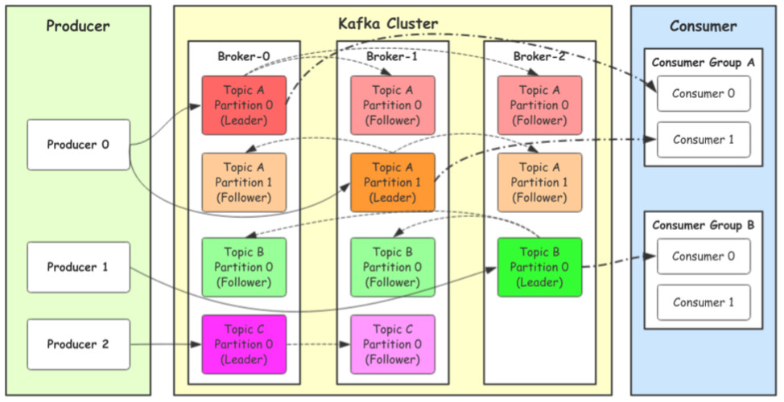

[TOC]

# kafka介绍

## 消息队列的通信模型

### 点对点模式（queue）

消息生产者生产消息发送到queue中，然后消息消费者从queue中取出并消费消息。一条消息被消费以后，queue中就没有了，不存在重复消费

### 发布订阅（topic）

消息生产者（发布）将消息发布到topic中，同时有多个消费者（订阅）消费该消息。和点对点方式不同，发布到topic的消息会被所有订阅者消费（类似于关注了微信公众号的人，都能收到推送的消息）<br>

补充：发布订阅模式下，当发布者消息量很大时，显然单个订阅者的处理能力是不足的，实际上现实场景中是多个订阅者节点组成一个订阅组负载均衡消费topic消息即分组订阅，这样订阅者很容易实现消费能力线性扩展。可以看成是一个topic下有多个queue，每个queue是点对点的方式，queue之间发布订阅方式

## kafka集群架构



### producer

> producer生产者，消息的产生者，是消息入口

### cluster

#### broker

> broker是指部署了kafka实例的服务器节点。每个服务器上有一个或者多个kafka的实例，我们认为每个broker对应一台服务器。每个kafka集群内的broker都有一个不重复的编号，如broker-0、broker-1...

#### topic

> 消息的主题，可以理解为消息的分类，kafka的数据就保存在topic。每个broker上都可以创建多个topic。实际应用中通常是一个业务线建一个topic

#### partition

> topic的分区，每个topic可以有多个分区，分区的作用是做负载，提高kafka的吞吐量。同一个topic在不同的分区的数据是不重复的，partition的表现形式就是一个一个的文件夹

#### replication

> 每个分区都有多有副本，副本的作用是做备胎。当主分区（leader）故障的时候回选择一个备胎（follower）上位，称为leader。在kafka中默认副本的最大数量是10个，且副本的数量不能大于broker的数量，follower和leader绝对不能在同一台机器上，同一机器对同一个分区也只可能存放一个副本（包括他自己）

### consumer

> 消费者，即消息的消费方，是消息的出口

#### consumer group

>  我们可以将多个消费组组成一个消费组组，在kafka的设计中同一个分区的数据只能被消费组中的某一个消费者消费。同一个消费者组的消费者可以消费同一个topic的不同分区的数据，这也是为了提高kafka的吞吐量

## 生产者往kafka发送数据的流程(6步)

## kafka选择分区的模式(3种)

## 生产者往kafka发送数据的模式(3种)

## 分区存储文件的原理

## 为什么kafka快

## 消费者组消费数据的原理

# 操作kafka

```GO
package main

import (
	"fmt"
	"github.com/Shopify/sarama"
)

// 基于sarama第三⽅库开发的kafka client
func main() {
	config := sarama.NewConfig()
	// tailf包使⽤
	config.Producer.RequiredAcks = sarama.WaitForAll // 发送完数据需要leader和follow都确认
	config.Producer.Partitioner = sarama.NewRandomPartitioner // 新选出⼀个 partition
	config.Producer.Return.Successes = true // 成功交付的消息将在success channel返回

	// 构造⼀个消息
	msg := &sarama.ProducerMessage{}
	msg.Topic = "web_log"
	msg.Value = sarama.StringEncoder("this is a test log")

	// 连接kafka
	client, err := sarama.NewSyncProducer([]string{"127.0.0.1:9092"}, config)
	if err != nil {
		fmt.Println("producer closed, err:", err)
		return
	}
	fmt.Println("连接kafka成功！")
	defer client.Close()
	// 发送消息
	pid, offset, err := client.SendMessage(msg)
	fmt.Println("xxx")
	if err != nil {
		fmt.Println("send msg failed, err:", err)
		return
	}
	fmt.Printf("pid:%v offset:%v\n", pid, offset)
	fmt.Println("发送成功！")
}
```

