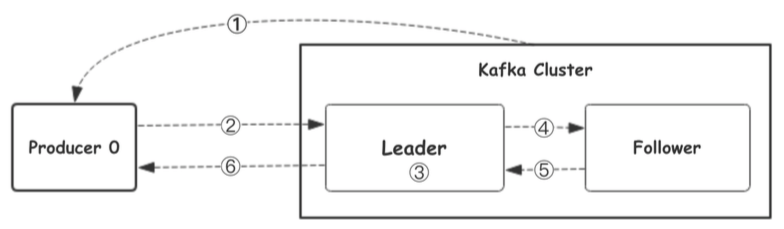
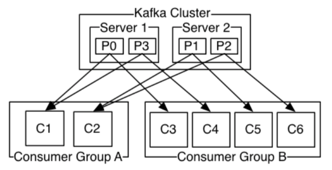

[TOC]

# kafka介绍

Kafka具有⾼吞吐、低延迟、高容错等特点

## 消息队列的通信模型

### 点对点模式（queue）

消息生产者生产消息发送到queue中，然后消息消费者从queue中取出并消费消息。一条消息被消费以后，queue中就没有了，不存在重复消费

### 发布订阅（topic）

消息生产者（发布）将消息发布到topic中，同时有多个消费者（订阅）消费该消息。和点对点方式不同，发布到topic的消息会被所有订阅者消费（类似于关注了微信公众号的人，都能收到推送的消息）<br>

补充：发布订阅模式下，当发布者消息量很大时，显然单个订阅者的处理能力是不足的，实际上现实场景中是多个订阅者节点组成一个订阅组负载均衡消费topic消息即分组订阅，这样订阅者很容易实现消费能力线性扩展。可以看成是一个topic下有多个queue，每个queue是点对点的方式，queue之间发布订阅方式

## kafka集群架构


### producer

> producer生产者，消息的产生者，是消息入口

### cluster

#### broker

> broker是指部署了kafka实例的服务器节点。每个服务器上有一个或者多个kafka的实例，我们认为每个broker对应一台服务器。每个kafka集群内的broker都有一个不重复的编号，如broker-0、broker-1...

#### topic

> 消息的主题，可以理解为消息的分类，kafka的数据就保存在topic。每个broker上都可以创建多个topic。实际应用中通常是一个业务线建一个topic

#### partition

> topic的分区，每个topic可以有多个分区，分区的作用是做负载，提高kafka的吞吐量。同一个topic在不同的分区的数据是不重复的，partition的表现形式就是一个一个的文件夹

#### replication

> 每个分区都有多有副本，副本的作用是做备胎。当主分区（leader）故障的时候回选择一个备胎（follower）上位，称为leader。在kafka中默认副本的最大数量是10个，且副本的数量不能大于broker的数量，follower和leader绝对不能在同一台机器上，同一机器对同一个分区也只可能存放一个副本（包括他自己）

### consumer

> 消费者，即消息的消费方，是消息的出口

#### consumer group

>  我们可以将多个消费组组成一个消费组组，在kafka的设计中同一个分区的数据只能被消费组中的某一个消费者消费。同一个消费者组的消费者可以消费同一个topic的不同分区的数据，这也是为了提高kafka的吞吐量

## 生产者往kafka发送数据的流程(6步)



1. 生产者从kafka集群获取分区的leader信息
2. 生产者将消息发送到leader
3. leader将消息写入本地磁盘
4. follower从leader拉取消息数据
5. follower将消息写入本地磁盘后向leader发送ack确认
6. leader收到所有的follower的ack之后向生产者发送ack确认

## kafka选择分区的模式(3种)

1. partition在写入的时候可以指定需要写入的partition，如果有指定，则写入对应的partition
2. 如果没有指定partition，但是设置了数据的key，则会根据key的值hash出来partition
3. 如果既没指定partition，又没有设置key，则会采用轮询方式，即每次取一小段时间的数据写入某个partition，下一小段的时间写入下一个partition。

## 生产者往kafka发送数据的模式(3种)

producer在向kafka写入消息的时候，可以设置参数来确定是否确认kafka接收到数据。

1. 0：代表producer往集群发送数据不需要等到集群的返回，不确保消息发送成功。安全性最低、但是效率最高。
2. 1：代表producer往集群发送数据只要leader应答就可以发送下一条，只确保leader发送成功
3. all：代表producer往集群发送数据需要所有的follower都完成从leader的同步才会发送下一条，确保leader发送成功和所有的副本都完成备份。安全性最高、但是效率最低。

**注意：**如果往不存在的topic写数据，kafka会自动创建topic，partition和replication的数量默认都是1.

## 分区存储文件的原理

`topic`是同一类别的消息记录的集合。在kafka中，一个主题通常有多个订阅者。对于每个主题，kafka集群委会了一个分区数据日志文件结构如下


每个partition都是一个有序并且不可变的消息记录集合。当新的数据写入时，就被追加到partition的末尾。在每个partition中，每条消息都会被分配一个顺序的唯一标识，这个标识被称为`offset`，即偏移量。注意，kafka只保证在同一个partition内部消息是有序的，在不同partition之间，并不能保证消息有序。<br>

kafka可以配置一个`保留期限`，用来标识日志会在kafka集群内保留多长时间。`kafka集群会保留在保留期限内所有被发布的消息，不管这些消息是否被消费过`。比如保留期限设置为俩天，那么数据被发布到kafka集群的来俩天以内，所有的这些数据都可以被消费。当超出俩天，这些数据将会被清空，以便为后续的数据腾出空间。由于kafka会将数据进行持久化存储（写入磁盘），所以保留的数据大小可以设置为一个比较大的值。

## 为什么kafka快,partition结构

partition在服务器上的表现相似就是一个一个的文件夹，每个partition的文件下面会有多组segment文件，每组segment文件又包含`.index`文件、`.log`文件、`.timeindex`文件三个文件，其中`.log`文件就是实际存储message的地方，而`.index`和`.timeindex`文件为索引文件，用于检索消息。

## 消费者组消费数据的原理



**举个例子：**如上图所示一个两个节点的Kafka集群上拥有`⼀个四个partition(P0-P3)的topic`。有两个 消费者组都在消费这个topic中的数据，消费者组A有``两个消费者实例`，消费者组B有`四个消费者实例`。 从图中我们可以看到，在同一个消费者组中，每个消费者实例可以消费多个分区，但是每个分区最多只 能被消费者组中的一个实例例消费。<br>

也就是说，如果有⼀个4个分区的主题，那么消费者组中最多只能有4个消费者实例去消费，多出来的都不会被分配到分区。其实这也很好理解，如果允许两个消费者实例同 时消费同⼀个分区，那么就⽆法记录这个分区被这个消费者组消费的offset了。如果在消费者组中动态 的上线或下线消费者，那么Kafka集群会自动调整分区与消费者实例间的对应关系。

# 操作kafka

```GO
package main

import (
	"fmt"
	"github.com/Shopify/sarama"
)

// 基于sarama第三⽅库开发的kafka client
func main() {
	config := sarama.NewConfig()
	// tailf包使⽤
	config.Producer.RequiredAcks = sarama.WaitForAll // 发送完数据需要leader和follow都确认
	config.Producer.Partitioner = sarama.NewRandomPartitioner // 新选出⼀个 partition
	config.Producer.Return.Successes = true // 成功交付的消息将在success channel返回

	// 构造⼀个消息
	msg := &sarama.ProducerMessage{}
	msg.Topic = "web_log"
	msg.Value = sarama.StringEncoder("this is a test log")

	// 连接kafka
	client, err := sarama.NewSyncProducer([]string{"127.0.0.1:9092"}, config)
	if err != nil {
		fmt.Println("producer closed, err:", err)
		return
	}
	fmt.Println("连接kafka成功！")
	defer client.Close()
	// 发送消息
	pid, offset, err := client.SendMessage(msg)
	fmt.Println("xxx")
	if err != nil {
		fmt.Println("send msg failed, err:", err)
		return
	}
	fmt.Printf("pid:%v offset:%v\n", pid, offset)
	fmt.Println("发送成功！")
}
```

