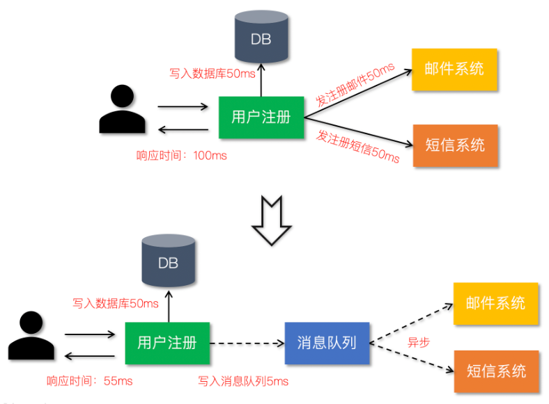
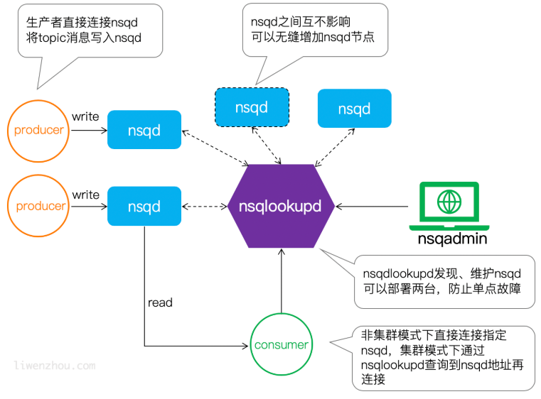

[TOC]

# nsq介绍

nsq是go语言编写的一个开源的实时分布式内存消息队列，性能优异。

1. nsq提倡分布式和分散的拓扑，没有单点故障，支持容错和高可用性，并提供可靠的消息交付保证
2. nsq支持横向扩展，没有任何集中式代理
3. nsq易于配置和部署，并且内置了管理界面

## 应用场景

### 异步处理

利用消息队列把业务流程中的非关键流程异步化，从而显著降低业务请求的响应时间



### 应用解耦

通过使用消息队列将不同的业务逻辑解耦，降低系统间的耦合，提高系统的健壮性，后续有其他业务要使用订单数据可直接订阅消息队列，提高系统的灵活性。

### 流量削峰

类似秒杀（大秒）等场景下，某一时间可能会产生大量的请求，使用消息队列能够为后端处理请求提供一定的缓冲区，保证后端服务的稳定性。


# nsq服务安装

## nsq组件

### nsqd

nsqd是一个守护进程，它接收、排队并向客户端发送消息。

```shell
nsqd --broadcast-address=127.0.0.1 -lookupd-tcp-address=127.0.0.1:4160

# 配置广播地址
--broadcast-address=127.0.0.1
# 如果使用了nsqlookupd，那么需要指定下面的，如果是部署的nsqlookupd集群，那么需要指定多个地址
-lookupd-tcp-address=127.0.0.1:4160
-lookupd-tcp-address=127.0.0.2:4160
```

### nsqlookupd

nsqlookupd是维护所有nsqd状态、提供服务发现的守护进程。它能为消费者查找特定topic下的nsqd，提供运行时的自动发现服务。

不维持持久化状态

不需要跟其他nsqlookupd实例协调以满足查询

因此可以尽可能多的部署nsqlookupd节点, 消耗内存很少，可以与其他服务共存。

```shell
nsqlookupd
```

### nsqadmin

一个实时监控集群状态、执行各种管理任务的Web管理平台。 启动`nsqadmin`，指定`nsqlookupd`地址:

```shell
./nsqadmin -lookupd-http-address=127.0.0.1:4161
```

## nsq架构

### nsq工作模式



### Topic和Channel

每个nsqd实例旨在一次处理多个数据流。这些数据流称为`“topics”`，一个`topic`具有1个或多个`“channels”`。每个`channel`都会收到`topic`所有消息的副本，实际上下游的服务是通过对应的`channel`来消费`topic`消息。

`topic`和`channel`不是预先配置的。`topic`在首次使用时创建，方法是将其发布到指定`topic`，或者订阅指定`topic`上的`channel`。`channel`是通过订阅指定的`channel`在第一次使用时创建的。

`topic`和`channel`都相互独立地缓冲数据，防止缓慢的消费者导致其他`chennel`的积压（同样适用于`topic`级别）。

`channel`可以并且通常会连接多个客户端。假设所有连接的客户端都处于准备接收消息的状态，则每条消息将被传递到随机客户端

总而言之，消息是从`topic -> channel`（每个channel接收该topic的所有消息的副本）多播的，但是从`channel -> consumers`均匀分布（每个消费者接收该channel的一部分消息）

### NSQ接收和发送消息流程

### NSQ特性

1. 消息默认不持久化，可以配置成持久化模式。nsq采用的方式时内存+硬盘的模式，当内存到达一定程度时就会将数据持久化到硬盘

	- --mem-queue-size设置为0，所有的消息将会存储到硬盘
	- 服务重启时也会将当前内存中的消息持久化

2. 每条消息至少传递一次

3. 消息不保证有序

# go操作nsq

`go get github.com/nsqio/go-nsq`

## consumer-消费者

```go
package main

import (
	"fmt"
	"os"
	"os/signal"
	"syscall"
	"time"

	"github.com/nsqio/go-nsq"
)

// myHandler 是一个消费者
type myHandler struct {
	Titler string
}

// HandleMessage 实现的处理消息的方法
func (m *myHandler) HandleMessage(msg *nsq.Message) (err error) {
	fmt.Printf("%s recv from %v,msg: %v\n", m.Titler, msg.NSQDAddress, string(msg.Body))
	return
}

//初始化消费者
func initConsumer(topic, channel, address string) (err error) {
	config := nsq.NewConfig()
	config.LookupdPollInterval = 15 * time.Second
	c, err := nsq.NewConsumer(topic, channel, config)
	if err != nil {
		fmt.Printf("create consumer failed,err:%v\n", err)
		return
	}
	consumer := &myHandler{
		Titler: "das1h号",
	}
	c.AddHandler(consumer) //传入一个带有HandleMessage方法的结构体,后台会开启多线程去获取数据然后执行这个方法
	if err := c.ConnectToNSQLookupd(address); err != nil {
		return err
	}
	return nil
}

func main() {
	err := initConsumer("topic_demo", "first", "127.0.0.1:4161")
	if err != nil {
		fmt.Printf("init consumer failed, err: %v\n", err)
		return
	}

	c := make(chan os.Signal)        //定义一个信号的通道
	signal.Notify(c, syscall.SIGINT) //转发键盘中断信号到通道中
	<-c
}
```

## Producer-生产者

```go
package main

import (
	"bufio"
	"fmt"
	"os"
	"strings"

	"github.com/nsqio/go-nsq"
)

//定义一个全局的生产者
var producer *nsq.Producer

//初始化生产者
func initProducer(nsqAdderss string) (err error) {
	config := nsq.NewConfig()
	producer, err = nsq.NewProducer(nsqAdderss, config)
	if err != nil {
		fmt.Printf("create producer faild,err: %v\n", err)
		return err
	}
	return nil
}

//生产数据,并创建一个topic,把数据发送到这个topic中
func writeNsq() {
	reader := bufio.NewReader(os.Stdin) //从标准输入读取内容
	for {
		data, err := reader.ReadString('\n')
		if err != nil {
			fmt.Println("read string from stdin failed,err: ", err)
		}
		data = strings.TrimSpace(data)
		if strings.ToUpper(data) == "Q" {
			break
		}
		//向 "topic_demo" publish 数据
		err = producer.Publish("topic_demo", []byte(data))
		if err != nil {
			fmt.Printf("publish msg to nsq failed, err: %v\n", err)
			continue
		}
	}
}
func main() {
	err := initProducer("127.0.0.1:4150")
	if err != nil {
		fmt.Println("初始化生产者失败,err:", err)
	}
	writeNsq()
}
```

