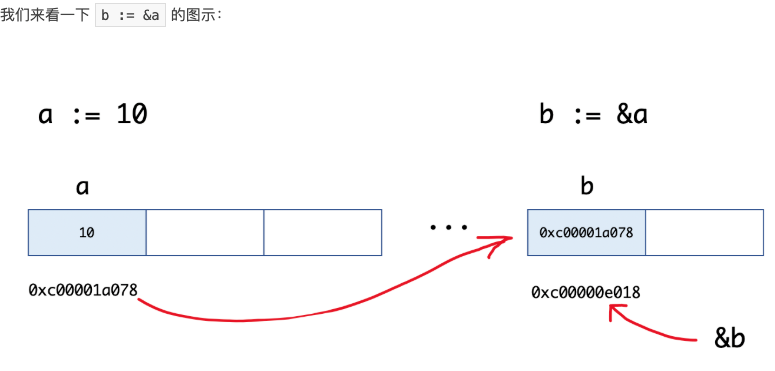

- [指针类型](#指针类型)
- [make和new的区别](#make和new的区别)
# 指针类型

1. 普通类型，变量存的就是值，也叫值类型
2. 获取变量的地址，用&，比如：var a int，获取a的地址：&a
3. 指针类型，变量存的是一个地址，这个地址存的才是一个值
4. 获取指针类型所指向的值，使用：*，比如：var *p int,使用*p获取p指向的值

```go
	// &: 取地址
	n := 18
	p := &n
	fmt.Printf("%v,%T\n", p, p)   //0xc000098000,*int
	fmt.Printf("%v,%T\n", &n, &n) //0xc000098000,*int
	// *: 根据地址取值
	fmt.Printf("%v,%p\n", *p, &p) //18,0xc000088018

	a := 10
	b := &a
	fmt.Printf("a:%d ptr:%p\n", a, &a) // a:10 ptr:0xc00001a078
	fmt.Printf("b:%p type:%T\n", b, b) // b:0xc00001a078 type:*int
	fmt.Println(&b)                    // 0xc00000e018
```




# make和new的区别

1. make和new都是用来申请内存的
2. new很少用，一般用来给基本数据类型申请内存，`string`、`int`,返回的是对应类型的指针(\*string、\*int)。
3. make是用来给`slice`、`map`、`chan`申请内存的，make函数返回的的是对应的这三个类型本身

```go
	var a1 *int     //定义一个空指针
	fmt.Println(a1) //<nil>

	var a2 = new(int) //new函数申请一个内存地址
	fmt.Println(a2)   //0xc000096008
	fmt.Println(*a2) 
	*a2 = 100 //对地址赋值
	fmt.Println(*a2)
```

