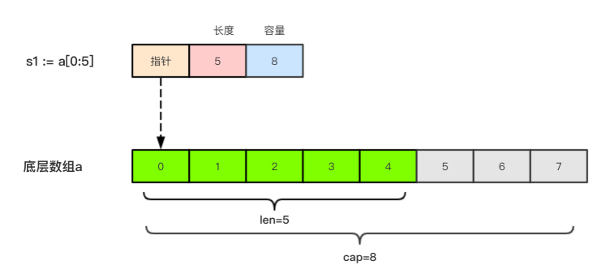
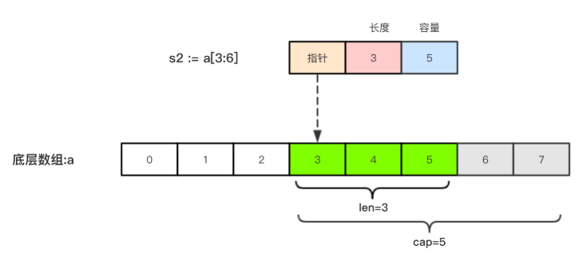

- [数组-array](#数组-array)
	- [数组的声明](#数组的声明)
	- [数组的初始化](#数组的初始化)
	- [数组的遍历](#数组的遍历)
	- [多维数组](#多维数组)
	- [多维数组遍历](#多维数组遍历)
- [切片-slice](#切片-slice)
	- [切片的初始化](#切片的初始化)
		- [基于数组定义切片](#基于数组定义切片)
		- [使用make()构造切片](#使用make构造切片)
	- [切片的len()和cap()](#切片的len和cap)
	- [切片的遍历](#切片的遍历)
	- [切片可以再次切片](#切片可以再次切片)
	- [切片的本质](#切片的本质)
	- [用append内置函数操作切片](#用append内置函数操作切片)
		- [关于append删除切片中的某个元素](#关于append删除切片中的某个元素)
	- [切片的拷贝-内置函数copy()](#切片的拷贝-内置函数copy)
- [string与slice](#string与slice)
	- [string内存布局](#string内存布局)
	- [如何改变string中的字符值](#如何改变string中的字符值)
- [排序和查找操作-sort包](#排序和查找操作-sort包)
- [array和slice类型的区别](#array和slice类型的区别)
# 数组-array

## 数组的声明

1. 数组是同一种数据类型的固定长度的序列

2. 数组的定义: 
  `var a [len]int,比如：var a[6]int`，一旦定义，长度不能变

3. 长度是数组类型的一部分,因此，

   ```go
   // var a[5] int`和` var a[10] int 是不同的类型
   func example() {
   	var a = [3]int{1, 2, 3}
   	var b = [5]int{1, 2, 3, 4, 5}
   	fmt.Printf("%v,%T\n", a, a) //[1 2 3],[3]int
   	fmt.Printf("%v,%T\n", b, b) //[1 2 3 4 5],[5]int
   }
   ```

4. 数组可以通过下标进行访问，下标是从0开始，最后一个元素下标是：len-1

5. 访问越界，如果下标在数组合法范围之外，则触发访问越界，会panic

   ```go
   // 访问越界问题
   func test1() {
   	var a [10]int
   	// j := 10 // 不能超出数组的范围，会报错panic
   	j := 9
   	a[0] = 10
   	a[j] = 100
   	fmt.Println(a)
   
   	for i := 0; i < len(a); i++ {
   		fmt.Println(a[i])
   	}
   	for index, val := range a {
   		fmt.Printf("a[%d]=%d\n", index, val)
   	}
   }
   ```

   

6. 数组是值类型，因此改变副本的值，不会改变本身的值

```go
//数组是值类型，改变副本的值，不会改变本身的值
func test2() {
	var a [10]int
	b := a   //相等于ctrl+c ctrl+v ==>把world文档从A文件复制到B文件
	b[0] = 101
	fmt.Println(a) //[0 0 0 0 0 0 0 0 0 0] a的值没有发生变化
}

// 如果需要 改变 原来的数组的值需要传入 地址 进去
func test3(arr [5]int) {
	arr[0] = 1000
}
func test4(arr *[5]int) {
	arr[0] = 1000
}
func test41() {
	var a [5]int
	test3(a)
	fmt.Println(a) //[0 0 0 0 0]
	test4(&a)      //&a传入值类型的地址
	fmt.Println(a) //[1000 0 0 0 0]
}
```
## 数组的初始化

>如果不初始化：默认元素都是零值（布尔值：false, 整型和浮点型都是0, 字符串：""）

```go
var age0 [5]int = [5]int{1, 2, 3} //自动填充0，初始化方式1  [1 2 3 0 0] 
var age1 = [5]int{1, 2, 3, 4, 5}  //初始化方式2   [1 2 3 4 5]
var age2 = [...]int{1, 2, 3, 4, 5} //自动计算长度，初始化方式3 [1 2 3 4 5]
var age3 = [...]int{2:100,5:200} //按照索引进行初始化，初始化方式4 [0 0 100 0 0 200]
var str = [5]string{3: "hello world", 4: "tom"}  //[   hello world tom]
```

## 数组的遍历

```go
	var s4 = [...]string{"青铜", "白银", "黄金", "白金"}
//索引遍历
	for i := 0; i < len(s4); i++ {
		fmt.Printf("%s\n", s4[i])
	}
//range遍历
	for i, v := range s4 {
		fmt.Printf("(%d,%s)\n", i, v)
	}
```

## 多维数组

```go
	//多维数组定义
	var i6 [3][2]int  //i6的类型是[3]（[2]int）类型
	i6 = [3][2]int{ //默认填充[0 0]数组
		[2]int{1, 3},
		[2]int{1, 2},
	}
	fmt.Println(i6) //[[1 3] [1 2] [0 0]]
```
## 多维数组遍历

```go
var f [2][5]int = [2][5]int{{1, 2, 3, 4, 5}, {6, 7, 8, 9, 10}} //2行5列
for row, v := range f { //遍历行，v其实也就是一个数组
	for col, v1 := range v { //遍历列
		fmt.Printf("{%d,%d}=%d", row, col, v1) //坐标的值
	}
	fmt.Println()
}
// {0,0}=1{0,1}=2{0,2}=3{0,3}=4{0,4}=5
// {1,0}=6{1,1}=7{1,2}=8{1,3}=9{1,4}=10
```
# 切片-slice

1. 切片是引用类型，都指向了底层的一个数组，`切片不保存值,只是内存地址引用的是底层的数组`

```go
	var a2 = [5]int{1, 2, 3, 4, 5}
	ss1 := a2[1:5]
	fmt.Println(ss1) //[2 3 4 5]
	a2[3] = 1000 //修改底层数组的值
	fmt.Println(ss1) //[2 3 1000 5] 切片ss1发生变化
```

1. 切片的长度是可以改变，因此，切片是一个可变的数组，切片的长度是它元素的个数

2. 切片遍历方式和数组一样，可以用len()求长度

3. cap可以求出slice最大的容量，`0<=len(slice) <= cap(array)`,其中array是slice引用的数组

   ```go
   // 长度和容量
   fmt.Printf("len(s1):%d cap(s1):%d\n", len(s1), cap(s1))
   fmt.Printf("len(s2):%d cap(s2):%d\n", len(s2), cap(s2)
   ```

4. 切片的定义：

  > 切片没有被初始化，默认是nil

  ```go
  // var 变量名 []类型
  // 切片的定义
  	var s1 []int           //定义一个元素为int类型的切片
  	fmt.Println(s1)        //[]
  	fmt.Println(s1 == nil) //true
  	s2 = []int{1, 2, 3} //给切片添加元素
  ```

## 切片的初始化

### 基于数组定义切片

```go
	// 由数组得到切片
	a1 := [...]int{1, 3, 5, 7, 9, 11, 13}
	s3 := a1[0:4] // 基于一个数组切割切片，左包含右不包含，（左闭右开）
	fmt.Println(s3)
	s4 := a1[1:6]
	fmt.Println(s4)
	s5 := a1[:4] // => [0:4] [1 3 5 7]
	s6 := a1[3:] // => [3:len(a1)]  [7 9 11 13]
	s7 := a1[:]  // => [0:len(a1)] 
  s8：= a1[:len(a1)-1]// =>去掉最后一个元素
	fmt.Println(s5, s6, s7)
```

### 使用make()构造切片


```go
var slice []type=make([]type,len)
slice := make([]type,len)
slice := make([]type,len,cap)

	//make 函数创造切片
	ms1 := make([]int, 5, 10)                         //定义切片类型，长度，容量
	fmt.Printf("%v,%d,%d\n", ms1, len(ms1), cap(ms1)) //[0 0 0 0 0],5,10
```
## 切片的len()和cap()

```go
	a4 := [...]int{4, 5, 6, 7, 8, 9, 0}
	s7 := a4[:4] //[4 5 6 7]
	s8 := a4[3:] //[7 8 9 0]
	s9 := a4[:]  //[4 5 6 7 8 9 0]
	//长度和容量
	fmt.Printf("len(s7)=%d,cap(s7)=%d\n", len(s7), cap(s7)) //len(s7)=4,cap(s7)=7
	fmt.Printf("len(s8)=%d,cap(s8)=%d\n", len(s8), cap(s8)) //len(s8)=4,cap(s8)=4
	fmt.Printf("len(s9)=%d,cap(s9)=%d\n", len(s9), cap(s9)) //len(s9)=7,cap(s9)=7
```
## 切片的遍历

```go
//切片的遍历和数组相同	
  for i := 0; i < len(ms1); i++ {
		fmt.Println(ms1[i])
	}
	for _, v := range ms1 {
		fmt.Println(v)
	}
```
## 切片可以再次切片

```go
var a = []int {1,2,3,4,5}
b := a[1:2]
b = b[0:3]
```

## 切片的本质

> 切片的本质就是对底层的数组的封装。包含3个信息：`底层数组的指针`、`切片的长度`和`切片的容量`

- 切片就是一个框，框住了一块连续的内存。
- 切片属于引用类型，真正的数据都是保存在底层数组里的。
- 判断一个切片是否是空的，要是用`len(s) == 0`来判断

```go
a:=[8]int{1,2,3,,4,5,6,7}
s1 := a[:5]
```



`s2 := a[3:6]`




## 用append内置函数操作切片

- append为切片追加元素，如果容量满了可以自动扩容
- 使用append函数，必须要用原来的切片变量来接收返回值
- append可以追加一个新的切片到原来的切片中，使用`...`展开切片

```go
	//append函数为切片追加元素
	as1 := []string{"青铜"}
	as1 = append(as1, "砖石") //使用append函数，必须要用原来的切片变量来接收返回值
	fmt.Println(as1)
	as1 = append(as1, "王者", "白金")
	ss11 := []string{"白银", "黄金"}
	as1 = append(as1, ss11...) //append追加一个切片到原来的切片中
	fmt.Println(as1) //[青铜 砖石 王者 白金 白银 黄金]
```

### 关于append删除切片中的某个元素

```GO
	aa1 := [...]int{1, 2, 3, 4, 5, 6, 7, 8, 9, 5, 4}
	aas1 := aa1[:]

	aas1 = append(aas1[:2], aa1[3:]...) //给切片aas1[:2]追加元素为一个切片aa1[3:]

	fmt.Println(aas1) //[1 2 4 5 6 7 8 9 5 4]
	fmt.Println(aa1) //[1 2 4 5 6 7 8 9 5 4 4]
```


## 切片的拷贝-内置函数copy()

- copy 是把原来的切片里面的全部元素拷贝到另一个切片里面，此时俩个切片之间没有任何关系

```go
	//copy()的使用,copy的是切片底层的数组，copy完成后，会变成俩个完全独立的切片，也就是深拷贝
	//copy(目标，原)
	ca1 := []int{1, 3, 5}
	ca2 := ca1                  //切片赋值
	var ca3 = make([]int, 5, 6) //make一个长度为5，容量为6的切片，默认值为[0 0 0 0 0]
	copy(ca3, ca1)              //copy
	fmt.Println(ca1, ca2, ca3)  //[1 3 5] [1 3 5] [1 3 5 0 0]
	ca1[0] = 100
	fmt.Println(ca1, ca2, ca3) //[100 3 5] [100 3 5] [1 3 5 0 0]
```

# string与slice

>string底层就是一个byte的数组，因此，也可以进行切片操作
```go
str := "hello world"
s1 := str[0:5]
fmt.Println(s1)

s2 := str[5:]
fmt.Println(s2)
```
## string内存布局


## 如何改变string中的字符值
> string本身是不可变的，因此要改变string中字符，需要如下操作：
```go
func testModifyString() {
	s := "hello world"
	s1 := []rune(s) //按照字符大小格式化

	s1[1] = '0'
	str := string(s1)
	fmt.Println(str)
}
```
# 排序和查找操作-sort包

> 转换为切片才能对数组进行排序
- sort.Ints对整数进行排序
- sort.Strings对字符串进行排序
- sort.Float64s对浮点数进行排序
- sort.SearchInts(a []int,b int) 从数组a中查找b,前提是a必须有序
- sort.SearchFloats(a []float64,b float64) 从数组a中查找b,前提是a必须有序
- sort.SearchStrings(a []string,b string) 从数组a中查找b,前提是a必须有序

```go
package main

import (
	"fmt"
	"sort"
)

// int进行排序
func testIntsort() {
	var a = [...]int{2, 4, 12, 5, 6, 2, 121, 3}
	sort.Ints(a[:])   //转换为切片才能对数组进行排序
	fmt.Println(a)
}

//字符串排序
func testStringSort() {
	var a = [...]string{"abc", "s", "sdfdsf", "xz", "q"}
	sort.Strings(a[:])
	fmt.Println(a)
}

// float排序
func testFloatSort() {
	var a = [...]float64{1.2, 32.1, 4.1, 2, 12, 3.2}
	sort.Float64s(a[:])
	fmt.Println(a)
}
//int类型搜索
func testIntSearch() {
	var a = [...]int{2, 4, 12, 5, 6, 222, 121, 3}
	// sort.Ints(a[:])
	index := sort.SearchInts(a[:], 121) //返回的是排序后的索引位置
	fmt.Println(index)
}
func main() {
	testIntsort()
	testStringSort()
	testFloatSort()
	testIntSearch()
}

```

# array和slice类型的区别

- `array`声明的时候，方括号里面需要注明array的长度；`slice`声明的时候，方括号为空

- 作为函数参数时，`array`传递的是一个数组的副本，而`slice`传递的是一个指针

- `array`是值类型，`slice`是引用类型

  