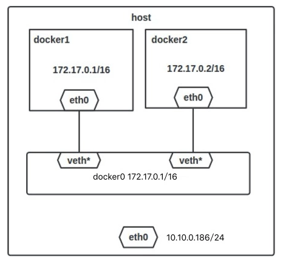
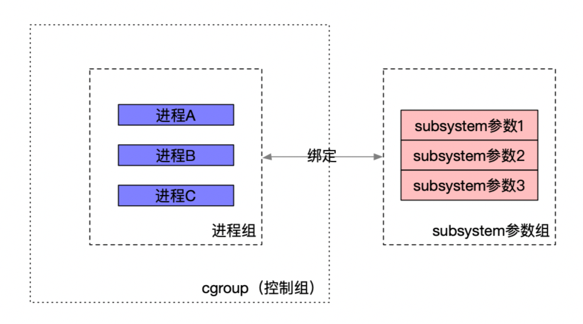
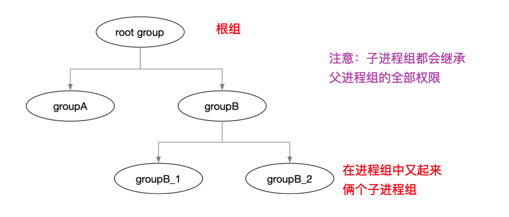
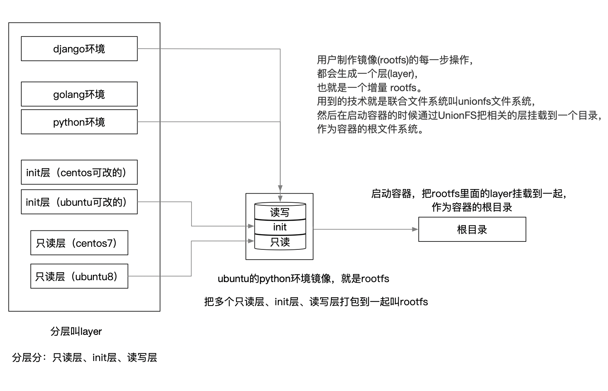

[toc]

# docker

## runC

runC是运行时，遵循了oci接口，一般来说基于libcontainer。用来运行容器的,可以认为它就是个命令行小工具，可以不用通过 docker 引擎，直接运行容器。

RunC 是运行容器的运行时，它**负责利用符合标准的文件等资源运行容器**，但是它**不包含 docker 那样的镜像管理功能**。所以要用 runC 运行容器，我们先得准备好容器的文件系统。所谓的 **OCI bundle 就是指容器的文件系统和一个 config.json 文件。**有了容器的文件系统后我们可以通过 runc spec 命令来生成 config.json 文件。使用 docker 可轻松的生成容器的文件系统，

## 网络模式

### host模式

与主机共享Root Network Namespace，容器有完整的权限可以操纵主机的协议栈、路由表和防火墙等，所以被认为是不安全的。

### container模式

使用--net=container:NAME_or_ID指定，与另一个运行中的容器共享Network Namespace，共享相同的网络视图。

### none模式

使用--net=none指定。不为容器配置任何网络功能。

### bridge模式（默认设置）

使用--net=bridge指定，默认设置。Docker设计的NAT网络模型。
Docker daemon启动时会在主机创建一个Linux网桥（默认为docker0，可通过-b参数手动指定）。容器启动时，Docker会创建一对veth pair（虚拟网络接口）设备，veth设备的特点是成对存在，从一端进入的数据会同时出现在另一端。Docker会将一端挂载到docker0网桥上，另一端放入容器的Network Namespace内，从而实现容器与主机通信的目的。bridge模式下的网络拓扑图如下图所示。



在桥接模式下，Docker容器与Internet的通信，以及不同容器之间的通信，都是通过iptables规则控制的。
总之，Docker网络的初始化动作包括：创建docker0网桥、为docker0网桥新建子网及路由、创建相应的iptables规则等。

## **cgroup**

Linux cgroups 的全称是 Linux Control Groups，它是 Linux 内核的特性，主要作用是**限制、记录和隔离进程组（process groups）使用的物理资源（cpu、memory、IO 等**）

### docker容器cgroup有2个驱动

#### cgroupfs驱动：

​	直接通过文件记录限制资源，比如对cpu进行限制，会直接把pid写入到对应的cgroup文件中，把cpu限制写入对应的cpu限制的文件。

#### systemd驱动

​	systemd本身提供了一套cgroup的管理方式。所有的写cgroup的限制，都需要通过调用systemd的接口来写入限制。不能通过手动来更改cgroup文件。

### Cgroups 有三个组件

1. cgroup （控制组）：负责对进程分组管理，一个cgroup包含一组进程，并可以在这个cgroup上增加Linux subsystem的各种参数的配置，将一组进程和一组subsystem的系统参数关联起来。

   

2. subsystem （子系统）：是一组资源控制模块，可以关联到 cgroup 上，并对 cgroup 中的进程做出相应限制。
   1. **devices**：设备权限控制。可以在容器中看到devices设备
   2. **cpuset**：分配指定的CPU和内存节点。
      1.  CPU 的使用量，可以把任务绑定到特定的cpu上面，还能绑定内存节点。但是要提前在cpuset的task文件中用户必须设置 cpuset.cpus 和 cpuset.mems 参数
         1. cpuset.cpus设置：设置 cgroup 中任务能使用的 CPU，比如0-2,7 表示 CPU 第 0，1，2，和 7 核。
         2. Cpuset.mems设置：设置 cgroup 中任务能使用的内存节点，和 cpuset.cpus 格式一样。
   3. **cpu**：控制CPU占用率。
      1. 控制分俩种：完全公平调度策略、实时调度策略
   4. **cpuacct**：统计CPU使用情况。
   5. **memory**：限制内存的使用上限。
      1. memory.limit_bytes：强制限制最大内存使用量
      2. memory.soft_limit_bytes：软限制，只有比强制限制设置的值小时才有意义
      3. memory.memsw.limit_bytes：设定最大内存与swap区内存之和的用量限制
   6. **freezer**：冻结（暂停）Cgroup中的进程，防止进程进行foce操作，避免进程逃逸到宿主机。
   7. net_cls：配合tc（traffic controller）限制网络带宽。
   8. net_prio：设置进程的网络流量优先级。
   9. huge_tlb：限制HugeTLB的使用。
   10. perf_event：允许Perf工具基于Cgroup分组做性能监测。性能分析
11. **blkio**：限制容器用到的磁盘的bps、io
   12. **pid**：容器中可以用到的最大pid数量
   
3. hierarchy(层级树) ：Linux 进程之间组成一棵树的结构，每个进程（除了 `init` 根进程之外）都有一个父进程，子进程创建之后会继承父进程的一些属性（比如环境变量，打开的文件描述符等）。和进程模型类似，只不过 cgroups 是一个森林结构。

   **注意：**

   1. **cgroup对该进程组的资源控制同样作用于子进程。**

   2. **一个继承可能处于多个进程组**
   3. **资源限制会优先本组权限，然后向外继承。**

   

### cgroups的作用

1. **资源限制**（Resource Limitation）：限制进程使用的资源上限，比如最大内存、文件系统缓存使用限制
2. **优先级分配**（Prioritization）：通过分配的 CPU 时间片数量及硬盘 IO 带宽大小，实际上就相当于控制了进程运行的优先级。
3. **资源统计**（Accounting）： cgroups 可以统计系统的资源使用量，如 CPU 使用时长、内存用量等等，这个功能非常适用于计费。
4. **进程控制**（Control）：cgroups 可以对进程组执行挂起、恢复等操作。

## **容器技术unionFS（容器镜像）**

用户制作镜像(rootfs)的每一步操作，都会生成一个层(layer)，也就是一个增量 rootfs。用到的技术就是联合文件系统叫unionfs文件系统，然后在启动容器的时候通过UnionFS把相关的层挂载到一个目录，作为容器的根文件系统。

### 使用的驱动为overlay2,以前使用的是aufs

下面的3个目录：

distribution：从远端拉到本地的镜像相关元数据

imagedb：镜像数据库

content：

layerdb：镜像每个层的元数据

repositories.json：本机的镜像版本信息的json列表，以及原始镜像sha256信息

### 什么是unionfs

> 联合文件系统（Union File System）,可以把多个目录内容联合挂载到同一个目录下，而目录的物理位置是分开的。UnionFS允许只读和可读写目录并存，就是说可同时删除和增加内容。

特点：将多个不同位置（不同权限）的目录联合挂载（union mount）到同一个目录下

### docker的镜像rootfs，和layer的设计

#### rootfs

为了让容器运行时一致，docker将依赖的操作系统、各种lib依赖整合打包在一起（即镜像），然后容器启动时，作为它的根目录（根文件系统rootfs），使得容器进程的各种依赖调用都在这个根目录里，这样就做到了环境的一致性。rootfs只是一个操作系统所包含的文件、配置和目录，并不包括操作系统内核。

#### layer分层的出现

用户制作镜像的每一步操作，都会生成一个层，也就是一个增量rootfs（一个目录），这样应用A和应用B所在的容器共同引用相同的Debian操作系统层、Golang环境层（作为只读层），而各自有各自应用程序层，和可写层。启动容器的时候通过UnionFS把相关的层挂载到一个目录，作为容器的根文件系统。

容器的rootfs分为三个部分:

- 可读层(rw)
  - 容器启动之前，在没有写入文件之前，这个目录是空的。
- init层(ro+wh)
  - 专门用来存放/etc/hosts、/etc/resolv.conf等信息，用来修改只读层的部分内容
- 只读层(ro+wh)
  - 都是一些必须要依赖的系统文件（最底层为bootfs（kernel）、rootfs、images层）



## namespace

### docker Namespace 的6种

首先要复习下namespace有几种：

**UTS namespace**:可以用来隔离 nodename 和 domainname 两个系统标识。在 UTS Namespace 中，每个 Namespace 可以有自己的 hostname。

**IPC namespace:**用来隔离 System V IPC 和 POSIX message queues。每一个 IPC Namespace 都有自己的 System V IPC 和 POSIX message queue。(消息队列、共享内存和信号量)

- **signal（信号量）：**没有必要隔离，当pid隔离后，signal自然就隔离了

- **pipe（父子进程共享内存通信）：**只能在父子进程之间通信，而命名管道和文件系统有关，所以只要做好文件系统的隔离，命名管道也就隔离了

- **socket（消息队列）：**和协议栈有关，而不同的network namespace有不同的协议栈，所以socket就被network namespace隔离了

**PID namespace：**

**network namespace：**

**user namespace:**

**Mount namespace:**

Cgroup namespace：

​	开启cgroup namespace，在容器中看到的cgroup视图是以根的方式展示。

​	不开启会继承服务器的cgroup目录结构


## dockerfile编写

### ENTRYPOINT和cmd区别

EXPOSE：我要打开的门是啥（声明端口号）

RUN：奔跑吧，兄弟！（进程要一直运行下去）

ENV：容器的环境变量

ENTRYPOINT： 指令不会被docker run提供的参数覆盖

CMD：容器需要执行的命令

## dockerfile多阶构建

> 构建一个编译型服务的时候，镜像是需要俩步骤
>
> 1. 第一个容器用来编译服务
> 2. 第二个容器用来移动服务到新的镜像中

```shell

FROM golang:1.7.3
WORKDIR /go/src/github.com/alexellis/href-counter/
RUN go get -d -v golang.org/x/net/html 
COPY app.go .
RUN CGO_ENABLED=0 GOOS=linux go build -a -installsuffix cgo -o app .
 
FROM alpine:latest  
RUN apk --no-cache add ca-certificates
WORKDIR /root/
# --form=0表示从上面的镜像中拷贝文件
# 如果上面的镜像是 FROM golang：1.7.3 as builder,那么下面就应该是--from=builder
COPY --from=0 /go/src/github.com/alexellis/href-counter/app .
CMD ["./app"] 
```

### 为什么镜像会变小很多？

**python解释性语言**

​	1. 通过俩个阶段减少镜像大小，主要是在第二阶段移动文件到新的镜像目录时，没有移动隐藏文件，导致镜像大小减小。

**go编译型语言**

	1. 通过俩个阶段减少镜像大小，主要是第一个阶段是用来编译镜像的，编译完成后，环境就没有用了，唯一有用的就是二进制文件
 	2. 然后再启动一个alpine空镜像，把编译完成的二进制文件放到里面去运行，达到缩小镜像大小的目的

# centos为啥能运行ubuntu容器

首先需要区分**Linux内核**与**Linux发行版**

- **Linux内核**是Linux操作系统的核心, 负责硬件管理, 比如管理内存、管理磁盘（文件系统）、管理CPU(进程)等等...
- **Linux发行版**是在**Linux内核**的基础上添加了一些工具软件,比如图形界面、函数库、软件包管理系统等等...

CentOS与Ubuntu是不同的**Linux发行版**, 它们都是基于**Linux内核**， 只是添加的工具软件不同。

因此CentOS与Ubuntu的内核是相同的(版本可能不同), 只是所安装的软件不同， 即文件系统不同。


Docker容器技术是基于**Linux内核**实现的， 它主要用到了两个内核模块:

- **Namespace**： 用于容器的隔离， 例如PID Namespace使得容器中的进程无法感知宿主机以及其他容器中的进程。
- **Cgroups**: 用于容器的资源控制， 比如限制容器所使用的内存大小或者CPU个数。

在CentOS上运行基于Ubuntu镜像的容器时, 容器使用了CentOS主机的内核以及Ubuntu镜像, 


## docker cadvisor监控

8个内存相关指标：

​	如果使用**container_memory_usage_bytes**，来作为容器的绝对使用内存，然后使用kube_pod_container_resource_limits_memory_bytes作为容器的限制内存。那么会出现内存使用超出kube_pod_container_resource_limits_memory_bytes的限制的问题。

分析原因：

​	发现**container_memory_usage_bytes**的内存计算是**container_memory_rss**+**container_memory_cache**，加到一起的内存总数，然而容器的限制内存不会包含cache的，导致出现容器使用内存超出我的限制内存。

最后使用了**container_memory_working_set_bytes**（工作集内存），作为容器内存的使用情况。可以比较确切的表达一个容器使用了多少内存。

