[toc]

# etcd的raft协议原理

分布式共识原理，理解实例：

第一阶段：一个节点很容易就达成协议或者共识

第二阶段：如果是多个节点如何达成共识？分布式共识问题

raft协议规定每个节点都有3个状态：**跟随，候选，领导者**

下面俩个图是领导人选举的过程：

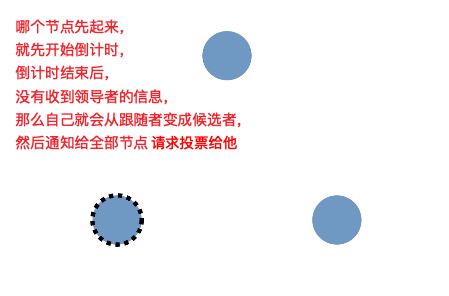

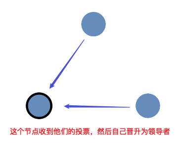

第三阶段：日志复制到数据写入过程，达到共识

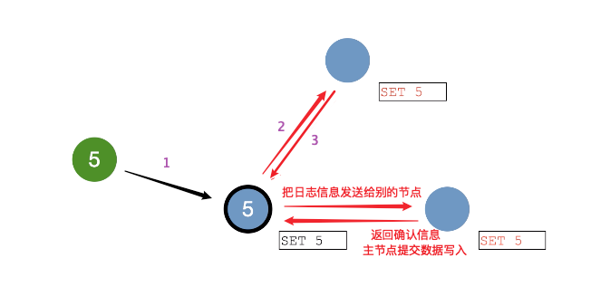

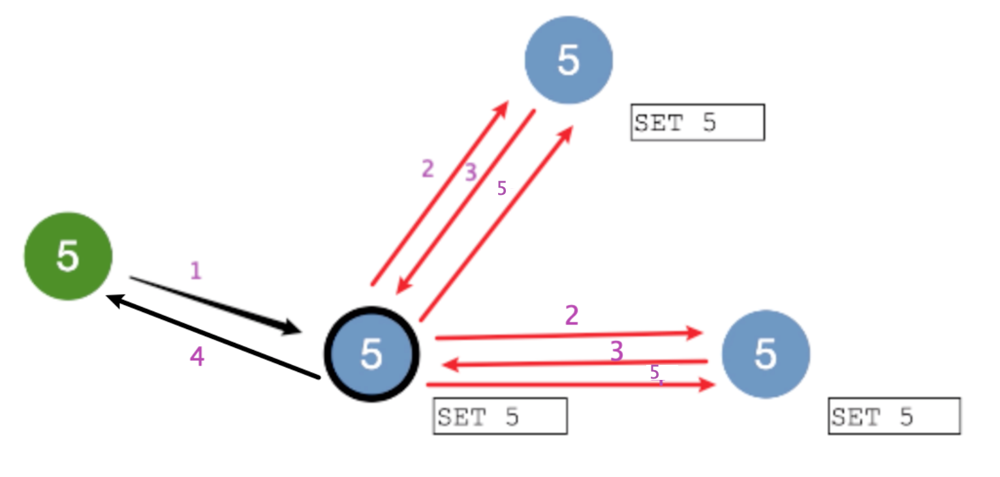

1. 客户端发送（数据5）到主节点，主节点会保存更改信息到节点日志中然后生成一个（日志条目5）
2. 服务端主节点当前的（日志条目5）是没有提交的，然后需要将（日志条目5）复制到跟随节点上。
3. 主节点等待大多数跟随节点都记录了该日志（日志条目5），然后主节点提交（数据5）写入
4. 主节点返回给客户端数据写入成功
5. 然后通知跟随者这个（日志条目5）已经提交写入，跟随者自己提交（数据5）写入，达到共识。

## 领导者选举

> 选举超时时间被随机分配在150ms-300ms之间
>
> 时钟周期（term）：也就是选举届次，leader节点发生变化，就会到下一届选举。term就会加1

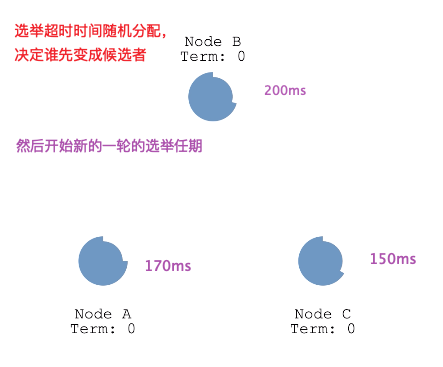

1. 各个节点随机获取超时时间，决定谁先变成候选者

   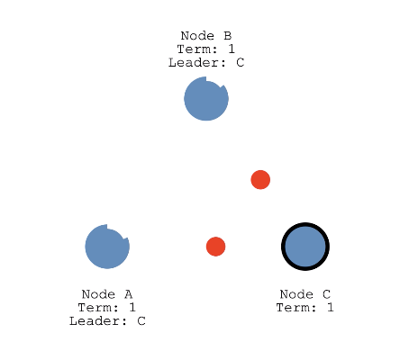

2. 候选者向各个追随者发起投票请求
3. 如果跟随者这届还没有投票，那么将投票给候选人。并重置自身的选举超时时间
4. 候选者获得获得大多数追随者的投票后变成领导者
5. 领导者开始向追随者发起心跳探测，以及发送日志条目给追随者，追随者响应每一条日志条目。然后每次都重置自身的选举超时时间

## 停止领导者，让集群重新选举

   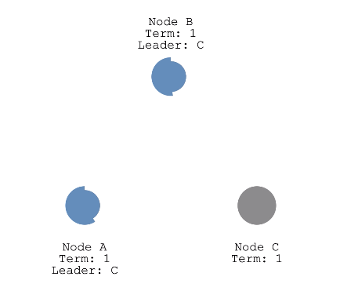

1. 停止领导者，全部节点进入下一个时钟周期，开始进行超时时间，获取候选者的权利
2. 最先为候选者的节点，发布投票，变成新的领导者

## 拆分表决，俩个节点都以相同任期进行选举

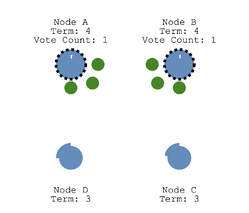

1. 俩个节点同时变为候选者，同时发起投票。

2. 每个都先到达一个跟随者节点，然后投票中，每个候选者都是两票。出现相同的票数

   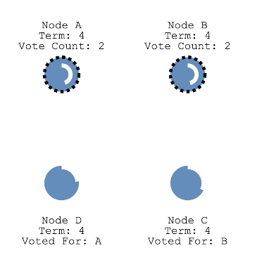

3. 通过超时时间，等待新的一轮时钟周期（选举），再选举一次。

4. 直到有节点获取多数选票，变成领导者为止。

## 集群网络出现问题，导致出现脑裂如何解决，以及日志复制的过程

>A&B 与C&D&E 变成俩个网络环境，集群A&B是正常的，还能正常通信，然后C&D&E 没有领导节点了，需要选举新的领导节点

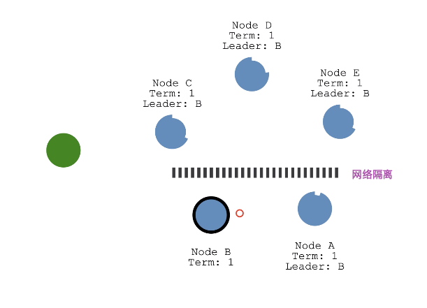

1. C&D&E没有领导节点发来的超时时间了，因此开始进入超时时间，争抢下一届的候选者的投票权

2. 根据投票最多的节点变成领导节点。

   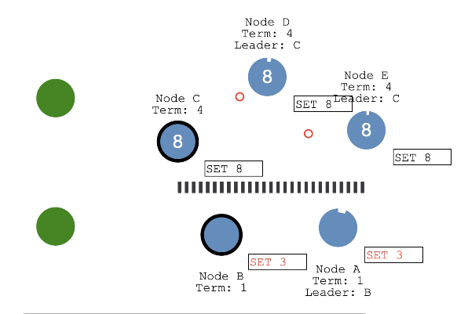

3. 这时候出现俩个客户端发送数据到俩个集群中。客户端1发送数据8到C&D&E集群，客户端2发送数据3到A&B集群。

4. 此时出现，C&D&E集群条目复制到跟随者，然后大多数跟随者返回响应，领导者把（数据8）写入成功。并且返回给客户端1；A&B集群（日志条目3）信息复制到跟随者，但是由于集群还保持着之前5个节点的状态，无法收到大多数跟随者返回的响应，导致领导者和跟随者节点（日志条目3）一直是未提交的状态。（数据3）无法写入集群

   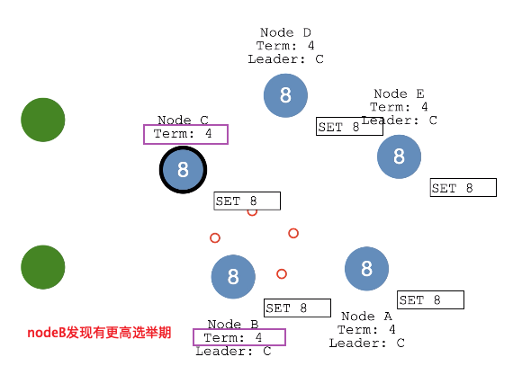

5. 网络恢复后,nodeB看到有更高的选举期限的节点，自己就会让出领导者的位置

6. 然后nodeA和nodeB回滚自己未提交的（日志条目3）

7. 新领导者的日志条目以心跳的方式同步给各个追随者，然后获取（日志条目8）提交（数据8）完成同步

8. 现在集群中日志在整个集群中是一致性

# Etcd是如何实现一致性的？

- raft通过对不同的场景（选主，日志复制）设计不同的机制，虽然降低了通用性（相对paxos），但同时也降低了复杂度，便于理解和实现。

- raft内置的选主协议是给自己用的，用于选出主节点，理解raft的选主机制的关键在于理解raft的时钟周期以及超时机制。

  **时钟周期(选举任期)：**如果集群出现脑裂，会进入下一届选举，选举出新的集群leader，此时集群中出现不同选举届选举的leader，如果集群恢复，会以最高届选举产生的leader为主。term，每个term代表一个主节点的任期，每次主节点变更term就会变化。

  **超时时间：**随机时间超时（150ms-300ms）让各个node的争抢候选者使用选举权

- 理解 Etcd 的数据同步的关键在于理解raft的日志同步机制。

  

# Etcd的存储是如何实现的？

> Etcd v2 和 v3 本质上是共享同一套 raft 协议代码的两个独立的应用，接口不一样，存储不一样，数据互相隔离

# Etcd的watch机制是如何实现的？

# Etcd的key过期机制是如何实现的？