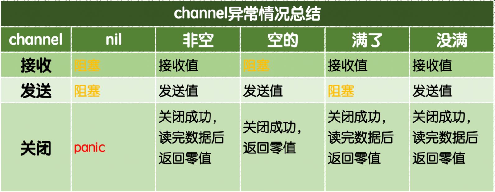
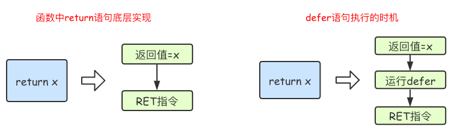
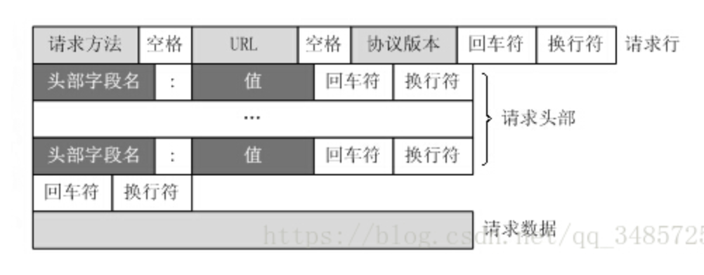

[toc]

# context

context作用是主动关闭运行中的goroute。

实现原理：通过向通道中发送信号，来达到关闭goroute，


俩个根节点，4个方法

## Background()和TODO()

Go内置两个函数：`Background()`和`TODO()`，这两个函数分别返回一个实现了`Context`接口的`background`和`todo`。我们代码中最开始都是以这两个内置的上下文对象作为最顶层的`partent context`，衍生出更多的子上下文对象。

- `Background()`主要用于main函数、初始化以及测试代码中，作为Context这个树结构的最顶层的Context，也就是根Context。

- `TODO()`，它目前还不知道具体的使用场景，如果我们不知道该使用什么Context的时候，可以使用这个。

`background`和`todo`本质上都是`emptyCtx`结构体类型，是一个不可取消，没有设置截止时间，没有携带任何值的Context。

## context包内的四个方法

### WithCancel

> 函数签名：`func WithCancel(parent Context) (ctx Context, cancel CancelFunc)`
>
> `WithCancel`返回带有新Done通道的父节点的副本。当调用返回的cancel函数或当关闭父上下文的Done通道时，将关闭返回上下文的Done通道，无论先发生什么情况。
>
> 取消此上下文将释放与其关联的资源，因此代码应该在此上下文中运行的操作完成后立即调用cancel

### WithDeadline

> 函数签名：`func WithDeadline(parent Context, deadline time.Time) (Context, CancelFunc)`
>
> 指定一个时间，是一个绝对时间。当前时间+50ms的方式

### WithTimeout

>函数签名：`func WithTimeout(parent Context, timeout time.Duration) (Context, CancelFunc)`
>
>`WithTimeout`返回`WithDeadline(parent, time.Now().Add(timeout))`
>
>使用相对的超时时间，多长时间之后。 超时时间50ms就主动关闭

### WithValue

> 函数签名：`func WithValue(parent Context, key, val interface{}) Context`

# channel操作的异常情况



# defer执行的时机

> go语言中函数的return不是原子操作，在底层是分为俩步来执行的
>
> 第一步：返回值赋值
>
> 第二部：真正的return返回
>
> 函数中如果存在defer，那么defer执行的时机是在第一步和第二步之间



```go
func calc(index string, a, b int) int {
	ret := a + b
	fmt.Println(index, a, b, ret)
	return ret
}

func main() {
	a := 1
	b := 2
	defer calc("1", a, calc("10", a, b)) //携带全部变量的状态，也就是说直接拷贝对应的值传入函数，但是不执行
	a = 0
	defer calc("2", a, calc("20", a, b))
	b = 1
}

// 1. a:=1
// 2. b:=2
// 3. defer calc("1", 1, calc("10", 1, 2))  
// 4. calc("10", 1, 2) // "10" 1 2 3
// 5. defer calc("1", 1, 3)
// 6. a = 0
// 7. defer calc("2", 0, calc("20", 0, 2))
// 8. calc("20", 0, 2) // "20" 0 2 2
// 9. defer calc("2", 0, 2)
// 10. b = 1
// calc("2", 0, 2) // "2" 0 2 2
// calc("1", 1, 3) // "1" 1 3 4

// 最终的答案：
// "10" 1 2 3
// "20" 0 2 2
//  "2" 0 2 2
// "1" 0 3 3
```

## defer和reture执行的时机

```go
// A. 匿名返回值的情况
func main() {
	fmt.Println("a return:", a()) // i=0 // 0. 执行函数得到返回值
}

func a() int {
	var i int
	defer func() {
		i++ 
		fmt.Println("a defer2:", i) //i=1+1  // 3. 获取目前i的值为1，然后+1，打印，得到的i的值为2
	}()
	defer func() {
		i++
		fmt.Println("a defer1:", i)  // i=0+1 // 2. 获取i的值为0，然后+1，打印，得到的i为1
	}()
	return i // i=0 //1. 会先保存变量的值，然后执行倒序执行defer函数
}

// B 有名返回值的情况
func main() {
	fmt.Println("b return:", b()) // 打印结果为 b return: 2
}

func b() (i int) {
	defer func() {
		i++
		fmt.Println("b defer2:", i) // 打印结果为 b defer2: 2
	}()
	defer func() {
		i++
		fmt.Println("b defer1:", i) // 打印结果为 b defer1: 1
	}()
	return i // 或者直接 return 效果相同
}

// 官方实例 1
func a()(result int) {
	     defer func() {
		        result++
		    }()
	return 0
}
func main() {
	fmt.Println(a()) // 返回 1
}
// 官方实例 2
func main() {
	for i:=0;i<=3;i++{
		defer fmt.Println(i) // 3 2 1 0 
	}
}
```

# http+protobuffer的方式

## 请求包格式




# Tcp udp 网络协议如何传输


# cookie和session的区别

1. Cookie 在客户端（浏览器），Session 在服务器端。
2. Cookie的安全性一般，他人可通过分析存放在本地的Cookie并进行Cookie欺骗。在安全性第一的前提下，选择Session更优。重要交互信息比如权限等就要放在Session中，一般的信息记录放Cookie就好了。
3. 单个Cookie保存的数据不能超过4K，很多浏览器都限制一个站点最多保存20个Cookie。 
4. Session 可以放在 文件、数据库或内存中，比如在使用Node时将Session保存在redis中。由于一定时间内它是保存在服务器上的，当访问增多时，会较大地占用服务器的性能。考虑到减轻服务器性能方面，应当适时使用Cookie。
5. Session 的运行依赖Session ID，而 Session ID 是存在 Cookie 中的，也就是说，如果浏览器禁用了 Cookie，Session 也会失效（但是可以通过其它方式实现，比如在 url 中传递 Session ID）。
6. 用户验证这种场合一般会用 Session。因此，维持一个会话的核心就是客户端的唯一标识，即Session ID。