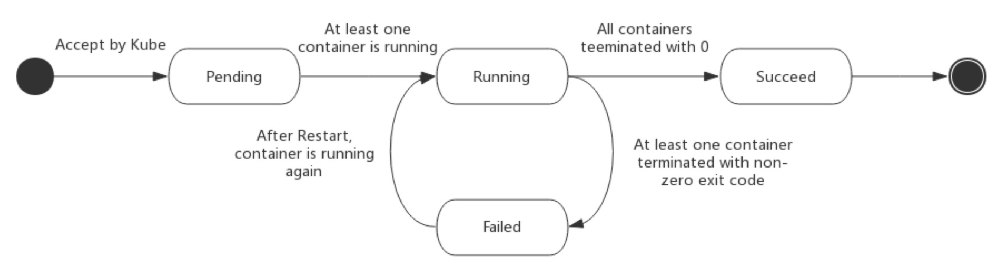

[toc]

# k8s

## pause(暂停)组件的作用

首先复制下docker的namespace

### pause容器主要为每个业务容器提供以下功能

- 在pod中担任Linux命名空间共享的基础；
  - pod中，user、UTS、mount、network都是共享的。
  - pod中，pid、ipc默认是不共享的
- 启用pid命名空间，开启init进程。
  - Pod中，PID默认是不共享的，因此IPC也是不共享的。k8s 1.8之后默认情况下是禁用的，除非由kubelet标志（--docker-disable-shared-pid=false）启用，所有我们看到一个pod中各个容器的pid是相互独立的。

如果没有启动pid命名空间共享，则Pod中的每个容器都将具有自己的PID 1，并且每个容器都需要收集僵尸进程本身。很多时候，这不是一个问题，因为应用程序很少产生其他进程，但僵尸进程使用内存是一个经常被忽视的问题。因此，由于PID命名空间共享使你能够在同一个Pod中的容器之间发送信号。

	引出僵尸进程：正常的进程结束后，会调用exit退出，变成一个僵尸进程，然后释放全部资源，等待父进程回收，如果**父进程没有安装sigchld信号处理函数调用wait()或者waitid()等待子进程结束，也没有显示忽略改信号**，那么他会一直是一个僵尸进程。如果父进程结束了，会交给init进程来回收。那如果父进程是一个循环，不会结束的话，那么子进程就会一直保持僵尸进程，不会释放资源。

## **一个pod启动的全生命周期**

## Scheduler 和manager的集群原理

## **scheduler的调度策略**

### 调度策略

> k8s的调度策略分为predicates（预选策略）和priorites（优选策略），整个调度过程分俩步

- 预选策略，predicates是强制性规则，遍历所有的node节点，安装具体的预选策略筛选出符合要求的node列表，如果没有node符合predicates策略规则，那么pod就会被挂起，直到有node能够满足
- 优选策略，在第一步筛选的基础上，按照优选策略为待选node打分排序，获取最优者

#### 预选策略--必须全部满足

1. CheckNodeCondition：检测node是否正常
2. GeneralPredicates：普通判断策略
   1. HostName: 检测pod对象是否定义了pod.spec.hostname
   2. PodFitsHostPorts：检测pods.spec.containets.ports.hostPort是否定义
   3. MatchNodeSelector：检测pod是否设置了pods.spec.nodeSelector
   4. PodFitsResources：检测pod的资源需求是否能被节点所满足
3. NoDiskConflict：检测pod依赖的存储卷是否能满足需求
4. PodToleratesNodeTaints: 检测pod上的spec.tolerations可容忍的污点是否完全包含节点上的污点
5. PodToleratesNodeNoExecuteTaints: 检测pod上是否启用了NoExecute级别的污点，默认没有启用
6. CheckNodeLabelPresence: 检测node上的标签的存在与否，默认没有启用
7. CheckServiceAffinity：将相同service pod的对象放到一起，默认没有启用
8. CheckVolumeBinding：检测节点上已绑定和未绑定的volume
9. NoVolumeZoneConflict：检测区域，是否有pod volume的冲突
10. CheckNodeMemoryPressure：检测内存节点是否存在压力
11. CheckNodePIDPressure：检测pid资源的情况
12. CheckNodeDiskPressure：检测disk资源压力
13. MatchInterPodAffity：检测pod的亲和性
14. 下面的几个策略一般用不上（EBS,GCE,Azure）对这几个云厂商的
15. MaxEBSVolumeCount: 确保已挂载的EBS存储卷不超过设置的最大值，默认39
16. MaxGCEPDVolumeCount: 确保已挂载的GCE存储卷不超过设置的最大值，默认16
17. MaxAzureDiskVolumeCount: 确保已挂载的Azure存储卷不超过设置的最大值，默认16

#### 优选策略

> 优选函数的评估: 如果一个pod过来，会根据启用的全部函数的得分相加得到的评估

1. LeastRequested：最少请求，与节点的总容量的比值， 
   计算公式：（cpu比值+内存比值）的一半
   (cpu((capacity-sum(requested))*10 / capacity)+memory((capacity-sum(requested))*10 / capacity)) / 2

2. BalancedResourceAllocation：cpu和内存资源被占用的比率相近程度，越接近，比分越高，平衡节点的资源使用情况，
   计算公式：
   cpu=cpu((capacity-sum(requested))*10 / capacity) 
   mem=memory((capacity-sum(requested))*10 / capacity)

3. NodePreferAvoidPods：在这个优先级中，优先级最高，得分非常高
   根据节点的注解信息“[scheduler.alpha.kubernetes.io/preferAvoidPods”](http://scheduler.alpha.kubernetes.io/preferAvoidPods”)

4. TaintToleration：将pod对象的spec.tolertions与节点的taints列表项进行匹配度检测，匹配的条目越多，得分越低

5. SeletorSpreading：尽可能的把pod分散开，也就是没有启动这个pod的node，得分会越高

6. InterPodAffinity：遍历pod的亲和性，匹配项越多，得分就越多

7. NodeAffinity：节点亲和性，亲和性高，得分高

8. MostRequested：空闲量越少的，得分越高，与LeastRequested不能同时使用，集中一个机器上面跑pod，默认没有启用

9. NodeLabel：根据node上面的标签来评估得分，有标签就有分，没有标签就没有分，默认没有启用

10. ImageLocality：一个node的得分高低，是根据node上面是否有镜像，有镜像就有得分，反之没有（根据node上已有满足需求的image的size的大小之和来计算。），默认没有启用

    

## kube-controller-manager

就是用来控制Pod的状态和生命周期的

### pod的生命周期

#### Pod phase（阶段）

- 挂起（Pending）：Pod 已被 Kubernetes 系统接受，但有一个或者多个容器镜像尚未创建。等待时间包括调度 Pod 的时间和通过网络下载镜像的时间，这可能需要花点时间。
- 运行中（Running）：该 Pod 已经绑定到了一个节点上，Pod 中所有的容器都已被创建。至少有一个容器正在运行，或者正处于启动或重启状态。
- 成功（Succeeded）：Pod 中的所有容器都被成功终止，并且不会再重启。
- 失败（Failed）：Pod 中的所有容器都已终止了，并且至少有一个容器是因为失败终止。也就是说，容器以非0状态退出或者被系统终止。
- 未知（Unknown）：因为某些原因无法取得 Pod 的状态，通常是因为与 Pod 所在主机通信失败。

#### pod5个状态

PodScheduled、Ready、Initialized、Unschedulable和ContainersReady

## deployment、ReplicationController、replicaset

Deployment 为 Pod 和 ReplicaSet 提供了一个声明式定义(declarative)方法，用来替代以前的ReplicationController 来方便的管理应用。典型的应用场景包括：

- 定义Deployment来创建Pod和ReplicaSet
- 滚动升级和回滚应用
- 扩容和缩容
- 暂停和继续Deployment

ReplicationController用来确保容器应用的副本数始终保持在用户定义的副本数，即如果有容器异常退出，会自动创建新的Pod来替代；而如果异常多出来的容器也会自动回收。ReplicaSet跟ReplicationController没有本质的不同，只是名字不一样，并且ReplicaSet支持集合式的selector。

虽然ReplicaSet可以独立使用，但一般还是建议使用 Deployment 来自动管理ReplicaSet，这样就无需担心跟其他机制的不兼容问题（比如ReplicaSet不支持rolling-update但Deployment支持）。

### Helm2 和helm3存储位置

helm2配置信息全部在tiller所在的名称空间存储，存储方式都是configmap方式

helm3配置信息分布在服务自己的namespace中，存储方式是secret方式

