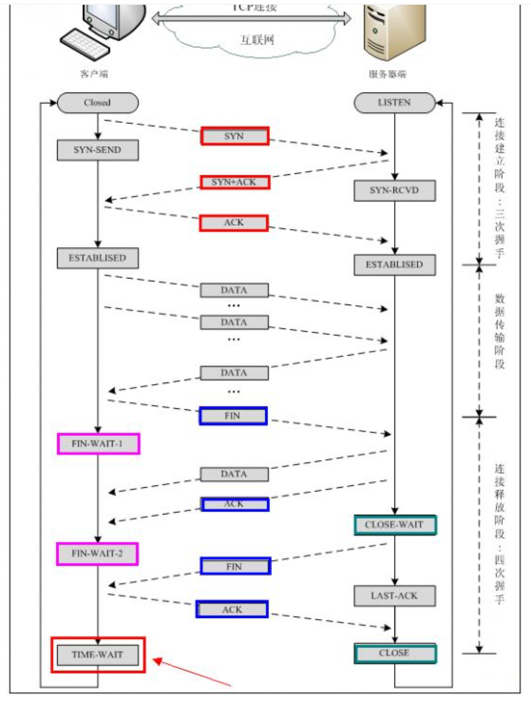
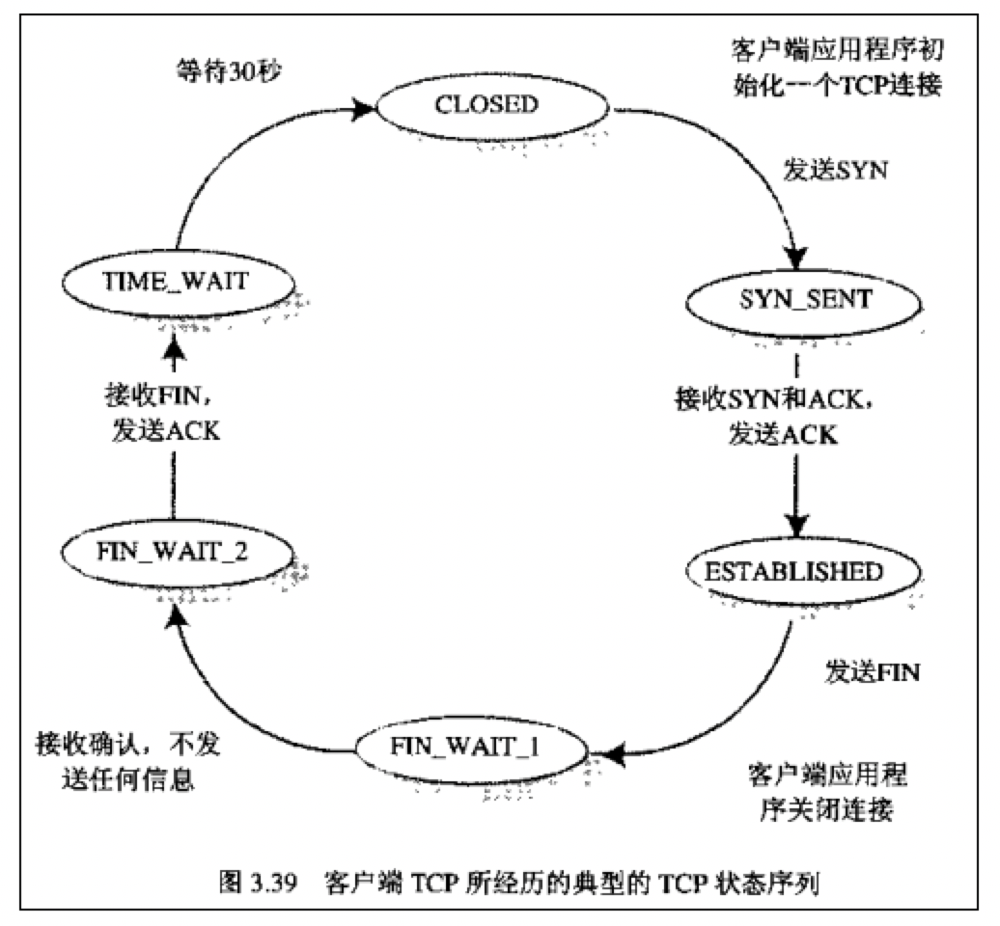
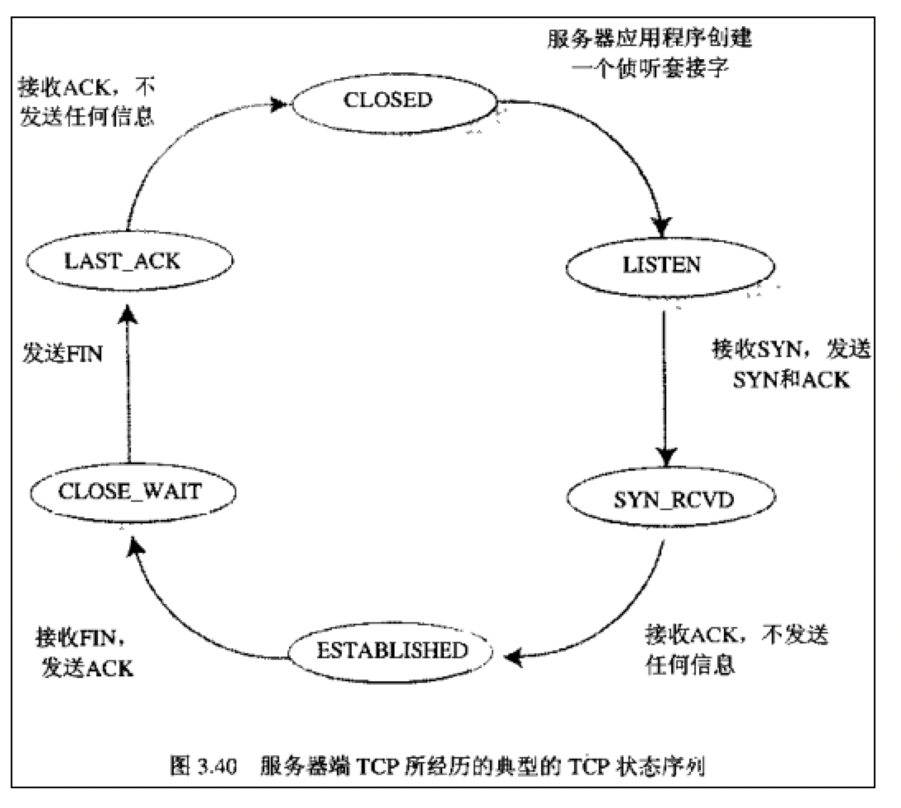
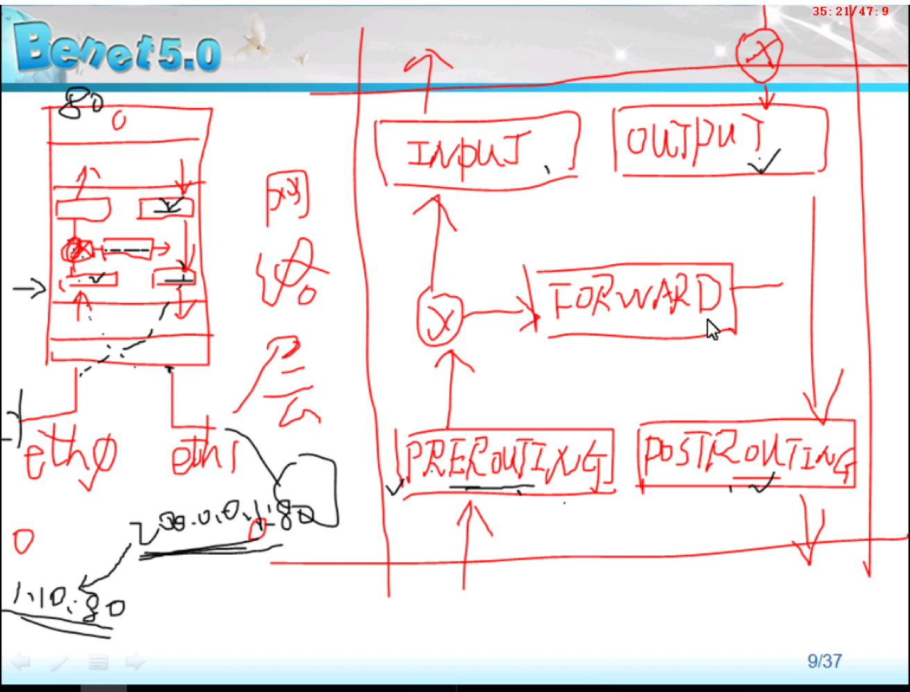

[toc]

# 用户态切换到内核态的3种方式

- 异常
  1. 当cpu在执行运行在用户态下的程序时，发生了一些没有预知的异常，如缺页异常
  2. 缺页异常: CPU通过地址总线可以访问连接在地址总线上的所有外设, 包括物理内存, IO设备等, 但是从CPU发出的访问地址并非是这些外设在地址总线上的物理地址, 而是一个虚拟地址, 由MMU将虚拟地址转换成为物理地址再从地址总线上发出, MMU这种虚拟地址和物理地址的转换关系是需要创建的, 并且MMU可以设置这个物理页是否可以进行写操作, 当没有创建一个虚拟地址到物理地址的映射, 或者创建了映射,但是物理页不可写时, MMU会通知CPU产生一个缺页异常
- 系统调用
  1. 创建新进程的系统调用，系统调用的机制和新是使用了操作系统为用户特别开放的一个中断来实现
- 外部访问中断
  1. 当外围设备完成用户请求的操作后，会向CPU发出相应的中断信号，这时CPU会暂停执行下一条即将要执行的指令而转到与中断信号对应的处理程序去执行，如果前面执行的指令时用户态下的程序，那么转换的过程自然就会是 由用户态到内核态的切换。如硬盘读写操作完成，系统会切换到硬盘读写的中断处理程序中执行后边的操作等。

# dns解析的全过程


# 内核参数调优

| 参数 | 解释 |
| ---- | ---- |
|net.ipv4.tcp_syncookies = 1 |表示开启SYN Cookies。当出现SYN等待队列溢出时，启用cookies来处理，可防范少量SYN攻击，默认为0，表示关闭；|
|net.ipv4.tcp_tw_reuse = 1 |表示开启重用。允许将TIME-WAIT sockets重新用于新的TCP连接，默认为0，表示关闭；|
|net.ipv4.tcp_tw_recycle = 1 |表示开启TCP连接中TIME-WAIT sockets的快速回收，默认为0，表示关闭。|
|net.ipv4.tcp_fin_timeout = 30 |表示如果套接字由本端要求关闭，这个参数决定了它保持在FIN-WAIT-2状态的时间。|
|net.ipv4.tcp_keepalive_time = 1200 |表示当keepalive起用的时候，TCP发送keepalive消息的频度。缺省是2小时，改为20分钟。|
|net.ipv4.ip_local_port_range = 1024    65000 |表示用于向外连接的端口范围。缺省情况下很小：32768到61000，改为1024到65000。|
|net.ipv4.tcp_max_syn_backlog = 8192 |表示SYN队列的长度，默认为1024，加大队列长度为8192，可以容纳更多等待连接的网络连接数。 |
|net.ipv4.tcp_max_tw_buckets = 5000 |表示系统同时保持TIME_WAIT套接字的最大数量，如果超过这个数字，TIME_WAIT套接字将立刻被清除并打印警告信息。默认为180000，改为5000。对于Apache、Nginx等服务器，上几行的参数可以很好地减少TIME_WAIT套接字数量，但是对于Squid，效果却不大。此项参数可以控制TIME_WAIT套接字的最大数量，避免Squid服务器被大量的TIME_WAIT套接字拖死。 |
|net.ipv4.route.gc_timeout = 100 |路由缓存刷新频率， 当一个路由失败后多长时间跳到另一个默认是300|
|net.ipv4.tcp_syn_retries = 1  |对于一个新建连接，内核要发送多少个 SYN 连接请求才决定放弃。不应该大于255，默认值是5，对应于180秒左右。 |
|net.ipv4.tcp_tw_recycle = 1  |快速回收time_wait状态的socket连接。|
|net.ipv4.tcp_tw_reuse = 1	|time_wait状态的连接重用|
|net.ipv4.tcp_timestamps = 1 |启用时间戳|
|kernel.panic=10<br />vm.panic_on_oom=1 |可以在触发 OOM 后立刻触发 kernel panic，kernel panic 10秒后自动重启系统|
|net.ipv4.ip_nonlocal_bind = 1 ||

# tcp连接的状态



## client端连接的过程



## server端连接的过程



# iptables



四表五链

```
raw  mange  nat  filter 4表
INPUT OUTPUT FORWARD POSTROUTING PREROUTING  5链
```

