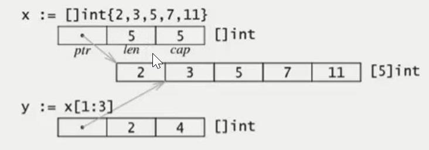

<!-- TOC -->

- [数组相关特性](#数组相关特性)
	- [斐波那契数列(非递归函数)](#斐波那契数列非递归函数)
	- [数组的初始化](#数组的初始化)
	- [多维数组](#多维数组)
	- [多维数组遍历](#多维数组遍历)
- [切片相关特性](#切片相关特性)
	- [切片的初始化（通过数组创建切片）](#切片的初始化通过数组创建切片)
	- [切片的内存布局](#切片的内存布局)
	- [通过make来创建切片](#通过make来创建切片)
	- [用append内置函数操作切片](#用append内置函数操作切片)
	- [for range 遍历切片](#for-range-遍历切片)
	- [切片resize(切片可以重复切片)](#切片resize切片可以重复切片)
	- [切片的拷贝-内置函数copy](#切片的拷贝-内置函数copy)
	- [string与slice](#string与slice)
	- [string内存布局](#string内存布局)
	- [如何改变string中的字符值](#如何改变string中的字符值)
	- [排序和查找操作-sort包](#排序和查找操作-sort包)

<!-- /TOC -->
# 数组相关特性
1. 数组是同一种数据类型的固定长度的序列

2. 数组的定义: 
`var a [len]int,比如：var a[6]int`，一旦定义，长度不能变
3. 长度是数组类型的一部分
```
长度是数组类型的一部分，因此，var a[5] int和 var a[10] int是不同的类型
```
4. 数组可以通过下标进行访问，下标是从0开始，最后一个元素下标是：len-1
5. 访问越界，如果下标在数组合法范围之外，则触发访问越界，会panic
6. 数组是值类型，因此改变副本的值，不会改变本身的值
```go
package main

import (
	"fmt"
)

// 访问越界问题
func test1() {
	var a [10]int
	// j := 10 // 不能超出数组的范围，会报错panic
	j := 9
	a[0] = 10
	a[j] = 100
	fmt.Println(a)

	for i := 0; i < len(a); i++ {
		fmt.Println(a[i])
	}
	for index, val := range a {
		fmt.Printf("a[%d]=%d\n", index, val)
	}
}

//数组是值类型，改变副本的值，不会改变本身的值
func test2() {
	var a [10]int
	b := a
	b[0] = 101
	fmt.Println(a) //[0 0 0 0 0 0 0 0 0 0] a的值没有发生变化
}
func test3(arr [5]int) {
	arr[0] = 1000
}

// 如果需要改变原来的数组的值需要传入地址进去
func test4(arr *[5]int) {
	arr[0] = 1000
}

func main() {
	test1()
	test2()

	var a [5]int
	test3(a)
	fmt.Println(a) //[0 0 0 0 0]
	test4(&a)      //&a传入值类型的地址
	fmt.Println(a) //[1000 0 0 0 0]
}
```
## 斐波那契数列(非递归函数)
```go
// 1 1 2 3 5 8 13 21 34
package main

import "fmt"

func fab(n int) {
	var a []uint64
	a = make([]uint64, n)

	a[0] = 1
	a[1] = 1
	for i := 2; i < n; i++ {
		a[i] = a[i-1] + a[i-2]
	}
	for _, v := range a {
		fmt.Println(v)
	}
}
func main() {
	fab(10)
}
```
## 数组的初始化
```go
var age0 [5]int = [5]int{1, 2, 3}
var age1 = [5]int{1, 2, 3, 4, 5}
var age2 = [...]int{1, 2, 3, 4, 5, 6, 7, 8, 9}
var age3 = [...]int{2:100,5:200}
var str = [5]string{3: "hello world", 4: "tom"}
fmt.Println(age0, age1, age2, age3, str)

// [1 2 3 0 0] [1 2 3 4 5] [1 2 3 4 5 6 7 8 9] [0 0 100 0 0 200] [   hello world tom]
```

## 多维数组
```go
var age [5][3]int
var f [2][3]int =[...][3]int{{1,2,3,4},{6,7,5,3}} //俩行，每一行是3个元素
```
## 多维数组遍历
```go
var f [2][5]int = [...][5]int{{1, 2, 3, 4, 5}, {6, 7, 8, 9, 10}} //2行5列
for row, v := range f { //遍历行，v其实也就是一个数组
	for col, v1 := range v { //遍历列
		fmt.Printf("{%d,%d}=%d", row, col, v1) //坐标的值
	}
	fmt.Println()
}
// {0,0}=1{0,1}=2{0,2}=3{0,3}=4{0,4}=5
// {1,0}=6{1,1}=7{1,2}=8{1,3}=9{1,4}=10
```
# 切片相关特性

1. 切片：切片是数组的一个引用，因此切片是引用类型
2. 切片的长度是可以改变，因此，切片是一个可变的数组
3. 切片遍历方式和数组一样，可以用len()求长度
4. cap可以求出slice最大的容量，`0<=len(slice) <= cap(array)`,其中array是slice引用的数组
5. 切片的定义：
`var 变量名 []类型，比如 var str []string      var arr []int`

## 切片的初始化（通过数组创建切片）
`定义一个数组：var arr [5]int = [...]int{1,2,3,4,5}`
1. 切片初始化：`var slice []int = arr[start:end]` 包含start到end之间的元素，但不包含end
2. `var slice []int = arr[0:end]` 可以简写为`var slice []int=arr[:end]`
3. `var slice []int = arr[start:len(arr)]` 可以简写为`var slice []int = arr[start:]`
4. `var slice []int = arr[0,len(arr)]`可以简写为`var slice []int = arr[:]`
5. 如果要切片最后一个元素去掉，可以这么写：`slice=slice[:len(slice)-1]`

## 切片的内存布局

```go
package main

import "fmt"

// 切片的内存布局-1
type slice struct { //定义一个结构体
	ptr *[5]int //定义一个指针
	len int
	cap int
}

func make1(s slice, cap int) slice {
	s.ptr = new([5]int)
	s.cap = cap
	s.len = 0
	return s
}

func modify(s slice) {
	s.ptr[1] = 1000
}
func testslice2() {
	var s1 slice
	s1 = make1(s1, 10)
	s1.ptr[0] = 100
	modify(s1)          //修改s.ptr[1]的值
	fmt.Println(s1.ptr) // &[100 1000 0 0 0]
}

// 切片的内存布局-2
func modify1(a []int) {
	a[1] = 1000
}
func testSlice3() {
	var b []int = []int{1, 2, 3, 4} //定义一个数组
	modify1(b)                      //通过函数修改数组b索引1的值
	fmt.Println(b)                  // [1 1000 3 4]，b数组发生变化
}

//演示切片的内存布局
func testslice4() {
	var a = [10]int{1, 2, 3, 4, 5} //定义一个数组
	b := a[1:5]                    //定义一个切片
	fmt.Printf("%p\n", b)          //打印切片b的内存地址
	fmt.Printf("%p\n", &a[1])      //打印数组a的内存地址
}

// 切片初始化练习,通过数组创建切片
func testslice() {
	var slice []int                          //切片定义，没有长度
	var arr [5]int = [...]int{1, 2, 3, 4, 5} //定义一个数组

	//长度和容量是相同的
	slice = arr[2:5]
	fmt.Println(slice) //[3 4 5]
	fmt.Println(len(slice))
	fmt.Println(cap(slice))

	//长度和容量是不相同的
	slice = slice[0:1]
	fmt.Println(slice) //[3]
	fmt.Println(len(slice))
	fmt.Println(cap(slice))
}

func main() {
	testslice()
	testslice2()
	testSlice3()
	testslice4()
}
```
## 通过make来创建切片

```go
var slice []type=make([]type,len)
slice := make([]type,len)
slice := make([]type,len,cap)
```
## 用append内置函数操作切片
```go
package main

import "fmt"

//如果切片大于数组的大小，会自动申请内存，扩展容量
func testslice() {
	var a [5]int = [...]int{1, 2, 3, 4, 5}
	s := a[1:]
	fmt.Printf("s=%p a[1]=%p\n", s, &a[1]) //俩个地址是相同的

	s = append(s, 123)
	s = append(s, 123)
	s = append(s, 123)
	s = append(s, 123)
	s = append(s, 123)
	fmt.Printf("s=%p a[1]=%p\n", s, &a[1]) //因为已经超过数组的大小了，切片从新申请内存
	fmt.Println(s)

	var c = []int{9, 8, 7}
	s = append(s, c...) //把一个数组添加到切片中
	fmt.Println(s)
}

func main() {
	testslice()
}
```

## for range 遍历切片
```go
for index,val := range slice {
	
}
```

## 切片resize(切片可以重复切片)
```go
var a = []int {1,2,3,4,5}
b := a[1:2]
b = b[0:3]
```

## 切片的拷贝-内置函数copy
>注意：copy是不会扩容
```go
s1 := []int{1,2,3,4,5}
s2 := make([]int,10)
copy(s2,s1)

s3 := []int{1,2,3}
s3=append(s3,s2...)
s3=append(s3,4,5,6)
```

## string与slice
>string底层就是一个byte的数组，因此，也可以进行切片操作
```go
str := "hello world"
s1 := str[0:5]
fmt.Println(s1)

s2 := str[5:]
fmt.Println(s2)
```
## string内存布局


## 如何改变string中的字符值
> string本身是不可变的，因此要改变string中字符，需要如下操作：
```go
func testModifyString() {
	s := "hello world"
	s1 := []rune(s) //按照字符大小格式化

	s1[1] = '0'
	str := string(s1)
	fmt.Println(str)
}
```
## 排序和查找操作-sort包
> 排序操作主要都在sort包中，导入就可以使用
- sort.Ints对整数进行排序
- sort.Strings对字符串进行排序
- sort.Float64s对浮点数进行排序
- sort.SearchInts(a []int,b int) 从数组a中查找b,前提是a必须有序
- sort.SearchFloats(a []float64,b float64) 从数组a中查找b,前提是a必须有序
- sort.SearchStrings(a []string,b string) 从数组a中查找b,前提是a必须有序

```go
package main

import (
	"fmt"
	"sort"
)

// int进行排序
func testIntsort() {
	var a = [...]int{2, 4, 12, 5, 6, 2, 121, 3}
	sort.Ints(a[:])
	fmt.Println(a)
}

//字符串排序
func testStringSort() {
	var a = [...]string{"abc", "s", "sdfdsf", "xz", "q"}
	sort.Strings(a[:])
	fmt.Println(a)
}

// float排序
func testFloatSort() {
	var a = [...]float64{1.2, 32.1, 4.1, 2, 12, 3.2}
	sort.Float64s(a[:])
	fmt.Println(a)
}
//int类型搜索
func testIntSearch() {
	var a = [...]int{2, 4, 12, 5, 6, 222, 121, 3}
	// sort.Ints(a[:])
	index := sort.SearchInts(a[:], 121) //返回的是排序后的索引位置
	fmt.Println(index)
}
func main() {
	testIntsort()
	testStringSort()
	testFloatSort()
	testIntSearch()
}

```